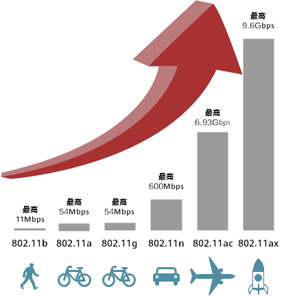
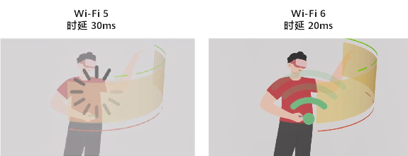

# 协议简介

## 序言

参考资料：

[Introduction to 802.11ax High-Efficiency Wireless](https://www.ni.com/zh-cn/innovations/white-papers/16/introduction-to-802-11ax-high-efficiency-wireless.html)

[WLAN从入门到精通-WIFI6](https://forum.huawei.com/enterprise/zh/forum.php?mod=viewthread&tid=639329)

## 什么是wifi6

说起Wi-Fi 6，其实是Wi-Fi联盟对IEEE的最新一代无线局域网标准802.11ax的命名。
这里面讲到了2个组织IEEE和Wi-Fi联盟。

首先介绍一下电气和电子工程师协会IEEE（Institute of Electrical and Electronics Engineers）。

IEEE作为标准组织，通信人应该非常了解，有兴趣可以百度一下。在该组织制定的一系列标准中，通信人最熟悉802.3标准对应以太网，而属于无线局域网的就是802.11。早在1990年，IEEE就已经成了802.11工作组用来制定无线局域网的相关标准，并在1997年发布了第一个标准802.11-1997。之后的每4-5年，802.11标准就会升级换代一次，至今已有6代。

而另一个组织，Wi-Fi联盟（英语全称Wi-Fi Alliance，简称WFA），其实是一个商业组织，这个联盟最初的目的是为了推动802.11b标准的制定，并在全球范围内推行Wi-Fi产品的兼容认证。兼容认证其实非常重要，因为802.11标准是很理论化，一旦产品化，每家厂商有可能会做的五花八门，所以Wi-Fi联盟所要解决的就是不同厂家的兼容性，此外Wi-Fi联盟还负责产品测试等工作。

我们现在熟悉的大部分手机厂商、部分运营商都是这个联盟的成员。
而我们常常说的Wi-Fi，实际上就是来自Wi-Fi联盟的商标。Wi-Fi联盟把符合802.11标准技术统一称为Wi-Fi。

2018年，为了方便记忆和理解，Wi-Fi联盟终于决定抛弃之前802.11n、802.11ac等专业标准名称，仿照移动通信中代际3G、4G、5G的划分，将现有标准简化为数字命名。

## 802.11ax简介

802.11ax是在802.11ac以后，无线局域网协议本身的进一步扩展，可以当做ac以后的一个直系版本。其初始的命名代号为HEW（High Efficiency WLAN ），该起始于2013年。

802.11ax的使用场景关注于密集用户环境（Dense User Environments），与之前的协议有所不同。根据香农定理而言，当SNR不变的情况下（由于发送机总功率是固定的），只要适当的增加带宽，就可以获得更高的物理层吞吐量。所以802.11a/b/g/n/ac的演进，一般都是关注在单AP的网络中，提高物理层的吞吐量，以提高网络的整体速率。

802.11ax的设计场景初始关注的就是密集环境，换言之，其初始设计思想就会和传统的802.11存在一定的区别。而且802.11ax的设计也并没有在当前802.11ac的160M带宽以上，新增更大的带宽（其实也是在2.4G和5G频谱资源下，无法找到更大带宽的信道）。所以协议命名的HEW，其关注的效率，也是希望更加有效的使用当前的频段资源，从而提供更高的实际网络速率。我们可以简单总结802.11ax的以下特点：

### 协议兼容性

802.11ax要求与以往的802.11a/b/h/n/ac都进行兼容，这也证明了其是第二款同时能工作在2.4G和5G频段下的协议（802.11ac仅工作在5G频段）。故在其数据帧结构和MAC接入协议上，都需要兼容设计，以便于传统协议兼容。

### 更高的速率

过去每一代Wi-Fi的标准，一直致力于提升速率。

经过20多年的发展，Wi-Fi 6（802.11ax）在160MHz信道宽度下，理论最大速率已经达到9.6Gbps，是802.11b的近900倍。

而Wi-Fi 6速率的提升是因为采用了更高阶的1024-QAM、更多的子载波等技术。

① **提供更高阶的编码组合**（MCS10和MCS11）。其中主要是QAM-1024的引入，在802.11ac中，最高阶是256QAM。

  ② **在相同带宽下，802.11ax采用点数更多的FFT**（即原始的FFT的4倍大小）。FFT点数越多，说明其子载波数越多，以及子载波的带宽也就越小（带宽从312.5kHz降到78.125kHz。其对应的symbol时间也增加了4倍），从而可以覆盖更远的范围。（覆盖范围与相干带宽有关。只要信道的带宽小于相干带宽的话，那么就是平坦衰落，信号不会受到多径的影响。所以越小的信道带宽，可以覆盖更远的范围）

### 高并发

  ① **引入上行MU-MIMO**。

Wi-Fi 6引入了5G中的OFDMA和上行MU-MIMO等多用户技术，进一步提升了频谱利用率，使得Wi-Fi 6相比于Wi-Fi 5，并发用户数提升了**4倍**。

在802.11ac中，协议只规定了下行的MU-MIMO。上行还是单个节点独立传输的，而在802.11ax中，上下行都需要支持MU-MIMO。

  ② **引入OFDMA技术**。802.11ax设计中参考了LTE中OFDMA的使用，可以让多个用户通过不同子载波资源同时接入信道，提高信道的利用率。不过因为802.11是一个分布式接入的场景，所以802.11ax中的OFDMA实际是比LTE中复杂度要低一些。

至于其中一些具体的介绍和一些其他的特性，建议参考NI的文章：[Introduction to 802.11ax High-Efficiency Wireless](https://link.zhihu.com/?target=http%3A//www.ni.com/white-paper/53150/en/)。

### 更好的节能性

用以增加移动设备的续航能力

随着IoT设备广泛应用，除了提升终端速率外，Wi-Fi 6更是关注了终端的耗电情况。

Wi-Fi 6采用TWT技术，按需唤醒终端Wi-Fi，加上20MHz-Only技术，使得终端的功耗降低**30%**。

### 降低时延

在低时延场景，例如VR/AR-互动操作模拟、全景直播、互动式游戏、沉浸式会议、高清无线投屏等，Wi-Fi 5的30ms时延已经无法满足需求，而Wi-Fi因为引入了OFDMA和空间复用技术BSS Coloring，令时延降低至**20ms**。

