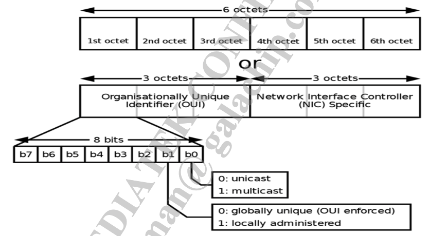
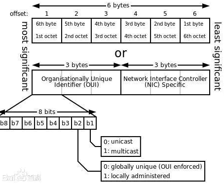
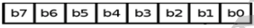

# Multiple BSSID (MBSSID)

## 介绍

MBSSID可以为用户提供额外看起来像真实WLAN的其他虚拟WLAN，它的常见应用是同时创建一个主网络和多个访客网络。

## MT7915在MBSS中生成MAC地址的规则

- 规则一：MTK转悠MAC地址扩展
- 规则二：遵循WFA 802.11v规范

> NOTE : 配置文件（.dat）具有最高优先级，即便MBSS中有MAC地址规则。
>
> 例如：MAC Address, MAC Address1~Mac Address15, APCli Mac Address

MAC Address帧格式如下：

摘自百度百科的Mac格式：

## 估计的MBSS Mac地址-规则1（MTK专有的Mac地址扩展）

- 从主MAC地址（ra0）到其他Mac地址
- 将本地位（local bit）设置为1
- 从MBSS编号（=Band 0 + Band 1）开始计算位掩码范围，并使用第三个字节
- 例如：

## 估计的MBSS Mac地址-规则2（WFA 802.11v规范）

