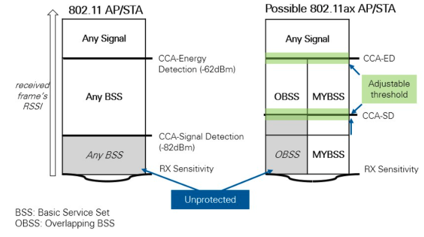

[TOC]

# 序言

BSS Coloring技术是802.11ax中引入，目的进一步优化空间复用（Spatial Reuse Parameter）。在前文讨论过关于BSS Coloring技术，但是关于如何基于BSS Coloring进行Spatial Reuse Parameter，还需要额外介绍Adaptive-CCA机制。本文就关于这两个问题做一个阐述。

本文参考自：

- [Future Indoor Networks: The role of Wi-Fi and its evolution - nokia bell lab](/books/Future-and-Indoor-Networks.pdf)
- [IEEE 802.11ax: Highly Efficient WLANs for Intelligent Information Infrastructure](/books/IEEE-802.11ax-Highly-Efficient-WLANs-for-Intelligent-Information-Infrastructure.pdf)
- [Introduction to 802.11ax High-Efficiency Wireless](https://www.ni.com/zh-cn/innovations/white-papers/16/introduction-to-802-11ax-high-efficiency-wireless.html)
- [Draft P802.11ax_D8.0.pdf](/books/Draft_P802.11ax_D8.0.pdf)
- [BSS COLOURING OR SPATIAL REUSE (802.11AX AKA WIFI6)](https://www.wifi-professionals.com/2019/07/bss-colouring-or-spatial-reuse-802-11ax-aka-wifi6)

# SRP空间复用（Spatial Reuse Parameter）

在802.11ax中，基于BSS Coloring，我们可以区分出Inter-BSS和Intra-BSS。如果现在一个Inter-BSS的节点检测到信道是忙的，但是其知道这个信道不是自己BSS正在进行传输，那么其可以认为信道是idle状态，进而继续backoff。如果backoff到0，那么其可以进行传输。

如上图所示，假设一个BSS的AP发送了一个SR-enable trigger frame（协议中称为SRP PPDU），代表当前的AP是允许一个SRP传输的。目前我理解的SRP仅仅支持AP上行接收的情况。AP发送完SRP TF帧后，其执行自己BSS内的一次传输，比如说一次上行传输。此时，如果一个支持SRP技术的Inter-BSS STA，也就是其他BSS Color下的节点，收到该SRP TF帧后。其会采用adaptive-CCA机制进行信道检测。如果其在adaptive-CCA的阈值下（即OBSS_PD阈值）检测信道是idle的，那么其可以继续执行backoff的操作。当backoff到0以后，其就可以执行一次数据的传输。

SR-enable的标志位应该是在PHY头部的HE-SIG-A1里面的Spatial Reuse field，这里面一共有4个field，可以设置disable SRP技术，也可以设置对应延迟或者具体的adaptive-CCA阈值等。

另外需要注意的是，这里允许传输的inter-BSS STA的数据帧大小也是有限制的。在一开始AP发送的TF帧中，实际上是包含了duration参数设置，代表其上行接收PPDU过程所需要的时间。inter-BSS需要在该Duration时间内完成SRP空间复用的传输，这里可能又会应用到动态帧分片技术了。

SRP技术实际上是一种利用捕获效应的空间复用技术，简单理解就是，如果当前AP的接收信号质量不错，不容易被干扰。那么此时就允许在该网络内，一个其他BSS的节点传输。由于本身我的信号强度够强，所以不会受到其他节点的干扰。该技术可以利用的核心机制就是adaptive-CCA机制，AP可以控制CCA的阈值，从而控制让部分节点（也就是不对自己产生干扰的节点）进行空间复用。

# Adaptive-CCA（自适应CCA）

**CCA技术是**802.11协议用来检测信道是否有数据包在传输的**物理载波监听技术**。

802.11ax除了传统的ED_Threshold和CS_Threshold，进一步引入了OBSS_PD这个参数。

上面左图描述的是传统802.11的情况，其中CCA-Energy Detection对应到EDThreshold（-82 dBm），CCA-Signal Detection对应到CS_Threshold（-62 dBm）。右边描述的是802.11ax中的情况，我们可以看到起CCA_SD实际上一个新的阈值（协议命名是OBSS_PD），其高于原来的CS_Threshold（-62 dBm），这个阈值是自适应调节的，所以被称为Adaptive-CCA。该阈值的目的就是用来区分，目前CCA检测到的数据帧是不是本BSS域内的。**按照SRP的规则，如果STA检测到该数据帧不是本BSS的，而且STA的信号强度是小于该Adaptive-CCA的，那么可以认为信道是idle，可以继续backoff**。

上面两个图进行分析：

- 首先STA进行能量检测
- 如果RSSI小于-82，则认为没有数据在传输，信道空闲。
- 如果RSSI大于-82，说明有数据在传输，开始PLCP解调，
- 如果PLCP解调失败，那么等待EIFS，等待完挂起到当前数据帧的传输结束
- 如果PLCP成功，那么它将读取框架标题以查看框架的颜色。
- 如果其颜色相同，说明信道忙，有数据，开始接收数据。如果要发送数据，则必须经过正常的CSMA / CA过程。
- 如果颜色与其自己的BSS不同，则说明它是一个BSS间帧，不需要接收该数据帧，但如果要发送数据，则需要与动态CCA值进行比较
- 如果RSSI大于OBSS_SD，说明OBSS的传输对MYBSS的干扰较大，标记MYBSS信道忙，不进行SR传输。
- 如果RSSI小于OBSS_SD，说明OBSS的传输对MYBSS的干扰较小，标记MYBSS信道空闲，可以开始backoff，到0时，可以进行上行传输
- 此时，还有另一个阈值检查，它检查帧的信号强度是否高于-62或低于。

在协议中，该OBSS_SD（本文命名有点杂，对应协议是OBSS_PD）是一个范围值，是AP根据网络情况自适应调节的，并且在Spatial Reuse field给出。

如上图所示，该范围是在-62dBm和-82dBm之间，也就是对应传统的ED_Threshold和CSThreshold之间。该图上的21dBm描述的参考的发送功率，TXPWR_Ref。
