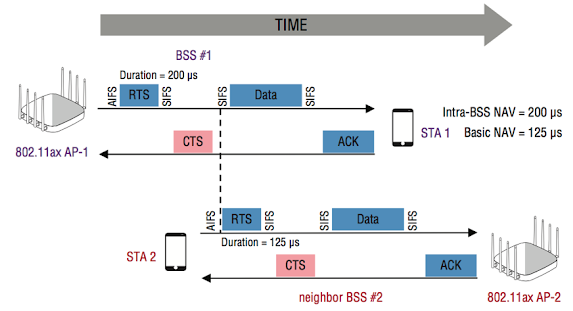

[TOC]

# 序言

NAV是802.11中最基本的MAC层元素之一，在802.11协议中起着非常重要的功能，而且先行协议下，基本上所有的兼容性机制都围绕的NAV展开。在802.11ax中，引入了双重NAV技术（Dueling NAVs）进一步扩展其功能，本文即针对这项技术做一个展开。

参考资料：

- [Dueling NAVs in 802.11ax](https://note-on-clouds.blogspot.com/2019/07/new-wifi-dueling-navs-in-80211ax.html)
- [802.11ax Preview 9: Dual NAV technology (Dueling NAVs)](https://www.programmersought.com/article/19873582929/)

# 802.11ax中的双重NAV技术（Dueling NAVs）

Wi-Fi使用两种载波侦听方法来确定信道是否繁忙，若繁忙那么要延迟进行传输。空闲信道评估（clear channel assessment，CCA）是检测信道是否繁忙的物理机制，同时在WiFi中，还存在一种虚拟载波监听机制，其和物理载波监听机制并行工作。虚拟载波侦听机制的核心是网络分配矢量（network allocation vector ，NAV）的定时器机制。

在802.11ax中已经引入了BSS Coloring机制，以适应在OBSS环境下，自适应调节空闲信道评估阈值（即adaptive CCA)，以增加空间信道的复用率，提供更多并行传输的可能性。

在BSS Coloring中引入的adaptive CCA也可以和虚拟载波监听的NAV组合使用，由于adaptive CCA中已经引入了两个不同的监测阈值，那么意味着其和NAV机制组合使用时，也需要两个独立的NAV定时器。在802.11ax中，目前已经新定义了两个NAV定时器：BSS内部的NAV定时器（intra-BSS NAV timer），和基本NAV定时器（basic NAV timer）。

- **BSS内部NAV定时器（intra-BSS NAV timer）**：其只够通过来自于同一个BSS内部的终端来设置，通过BSS内部终端传输的Duration/ID字段来设置NAV定时器的数值。
- **基本NAV定时器（basic NAV timer）**：其可由来自于不同BSS区域的终端来设置，也是根据这些终端传输的Duration/ID字段来设置NAV定时器的数值。

以上两个NAV定时器同时工作，如果由**任意一个NAV设置为非0**，也就是正在定时中，那么就认为信道是忙，正在被占据。

引入了两个NAV定时器是有益的，尤其在密集场景下。802.11ax的终端不仅仅需要保护其在BSS内部 （intra-BSS）传输的帧，还需要避免来与于其他BSS（即BSS间，inter-BSS）传输的干扰。

如上图所示，802.11ax AP-1发送了一个RTS帧（包含设置NAV=200us），以保护其与终端STA#1的数据帧交换。因为STA#1与AP-1相关联，即STA#1是AP-1这个BSS内部的终端（称该BSS为BSS#1），所以STA#1将**BSS内部NAV定时器**设置为200μs。然而，在数据帧交换期间，属于BSS#1（即AP-1）的终端（即STA#1）还可以收到不同BSS的客户端传递的RTS帧。比如终端STA#2传输的RTS帧（包含Duration=125us），其也会设置STA#1的NAV定时器，此时由于是不同BSS的终端设置，STA#1会将其**基本NAV定时器**设置成125us。在上图中，STA#1的内部NAV定时器首先倒数到0，但是其基本NAV定时器还没有倒数到0，还将继续递减。在此两个NAV定时器没有全部倒数至0之前，STA#1无法进行新的一轮发送。这种双重NAV的机制可以保证BSS#2中，帧的交换不受到干扰。
