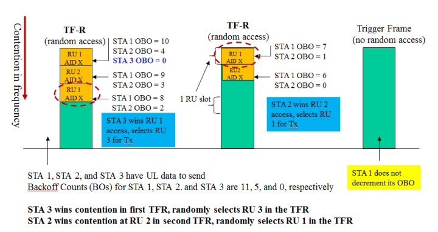

[TOC]

# 序言

在802.11ax以前，MAC的接入机制是典型的CSMA机制（即DCF中所采用的CSMA/CA）。

在引入了OFDMA的需求之后，802.11ax的MAC层随机接入机制也发生了变化，在协议中，代替传统的CSMA思想，802.11ax采用了基于ALOHA思想设计了竞争协议。其基本思想已经从强调分布式的场景，逐渐变成了强调中心式，高密度，优化资源分配上了。

本节主要就是介绍802.11ax中所采用的TF（Trigger Frame）以及TF-R（Trigger Frame for Random access）机制。

参考资料：

- [Wi-Fi_6_FD_Extreme_Networks_Special_Edition]()

# MAC层接入机制

  802.11ax提升效率的秘诀之一就是OFDMA技术。OFDMA是OFDM技术的多用户版本，在诸如LTE等的其他无线技术中已经被广泛采用。在OFDMA中，信道被细分称更小的单元，称为资源单元（Resource Units，RU） 。通过细分信道，OFDMA通过分配不同的RU给多终端，从而允许多个终端执行并行传输，同时接入无线网络。即总结而言，OFDMA是一种多用户传输技术。

  

  如上图所示，在802.11ax中，1个802.11ax AP将1个20 MHz信道划分为多个资源单元（RU），每一个RU被分配给不同的终端，802.11ax AP同时向这些终端进行下行传输。

  同时，802.11ax AP还可以同步调度802.11终端，让其执行并行的上行传输。

  在802.11ax中，竞争的规则还是存在的（即CSMA/CA）的规则，任何节点（包括AP）在发送之前都需要竞争。

  在此技术上，AP通过利用竞争（比如利用更高优先级的竞争参数）获得信道后，通过TXOP（transmission opportunity ）技术占据信道一段时间，从而达到控制信道接入的目的，因此802.11ax中AP具有一定的控制能力。

  一旦AP竞争并获得了TXOP是时间，AP可以控制高达9个802.11ax的终端进行上行传输或者下行传输（指的是在20MHz信道带宽下，最多可以承载9个RU，每一个RU为26个子载波）。

  针对于不同的TXOP，其RU的数量也是不一样的。对于上行接入（UL-OFDMA），AP采用触发帧机制（Trigger Frames），向802.11ax的终端进行调度和RU资源的分配。

  

  在802.11ax中，还存在一个OMI机制，这个机制是为了解决802.11终端是采用竞争接入信道（即单用户接入）还是采用OFDMA调度接入信道的（即多用户接入）。在OMI中，终端可以向AP发送信息，通知AP其支持的上下行所支持的最大空间流数目以及信道带宽。如上图所示，802.11ax终端采用OM控制字段（在数据帧或者管理帧中），来指示传输模式或者接收模式的变化。比如802.11ax终端可以在单用户接入或者多用户接入模式间切换。

# TF机制（Trigger Frame）

  802.11ax与传统的DCF所需求的MAC层机制是不同的。传统的DCF同一个时刻只有一个用户接入信道，而由于802.11ax采用OFDMA技术，其需求多个用户可以同一时间接入信道（选择的RU是正交的）。

  本节所介绍的TF机制，主要是用在UL MU（Uplink Multi-users）这种上行传输的场景下的。

  TF机制是一个**上行传输**的框架，其具体的随机接入的方法是TF-R机制。

  

  TF是一种上行接入的传输框架，其定义了一个很简单的过程：

  - AP发送Trigger frame，宣称这一轮接入开始。Trigger frame中，包含了节点上传所使用的时频资源（RU）信息。
  - 根据Trigger frame中的指示，节点选择其对应的RU位置，进行OFDMA的接入。多个节点同时向AP发送上行PPDU。
  - AP接收完全部数据后，反馈ACK，结束这一轮传输。

  TF帧不仅仅指定了什么节点发，还指定了节点的发送一系列参数，如下图：

  

  其中第一列是该RU被分配给那个用户（具体是指定用户的AID），如果AID设置为RA（协议中RA的AID号还没给定，即TBD），那么该RU就是供节点竞争的。后面的几列包含了比如Coding Type以及MCS值，这一块细节较多，暂时不展开。

  以上就是一个TF的接入框架，对比传统的802.11有以下不同：

  - **单节点接入和多节点接入：**传统的802.11中，都是单个节点占据整个信道的。在TF中，多个节点基于OFDMA，同时接入信道。
  - **发起者不同**：在传统的802.11中，节点只要竞争到信道，就可以立刻发起传输。而在TF中，只有当AP发送了TF帧之后，节点才可以发起上行接入竞争。
  - **ACK反馈时机不同**：在传统802.11中，ACK是在发送完之后，立刻被反馈的。而在TF中，ACK实际上是等所有用户都传输完之后，再一次反馈给所有接受者的。由于每一个发送者可能发送的数据包长短不一，所以先发送完的，需要等待后发送完的。这一点实际上也是多用户接入协议一个设计的公共问题。
  - **使用场景不同**：基于以上的几点不同，我们还可以理解，TF机制本身就是在假定网络是工作在基础架构的情况下，进行的设计，其不好在IBSS网络情况下工作。而传统802.11中的DCF设计，是既可以在基础架构模式下，也可以在IBSS模式下工作的。

  > 注：802.11ax中不是完全把DCF删除，而是分时采用不同的模式。TF机制主要是用在上行接入这一部分的。

# TF-R机制（Trigger Frame for Random access）

  TF-R是基于TF的进一步扩展，是在TF机制中，引入了竞争的机制，其基本思想是Slot-Aloha。

  

  TF-R是将原来时域竞争转为频域竞争（如左边红色竖线上所示）。

  TF-R是在前面所述的TF过程之前执行的，在每一次接入时，AP首先发送TF-R帧，在该帧中的部分RU其相应AID=X，这个X代表这个RU是供节点竞争接入的。节点在识别到TF-R帧之后，具体是采用OBO（UL-OFDMA Backoff）的机制竞争（TF-R的接入思想是基于Aloha而不是CSMA的主要原因也在这里）。

  > 注：Aloha和CSMA的核心区别在于LBT（Listen Before Talk）机制上：Aloha是没有LBT的，而CSMA是基于LBT的。

  在OBO中，每一个节点首先从CWO（Contention Window for UL-OFDMA）窗口中，选择一个随机数并放入Backoff counter中。

  如上图，STA1选择的是10，STA2选择的是4，STA3选择的是0。

  然后节点比较，这一轮TF-R帧中，可供竞争的RU slot的数目，比如上图RU数目为3。若Backoff counter小于RU的总数（比如STA3选择为0，其小于3），那么节点就可以发送数据，反之不行。那么该节点就随机选择一个RU（比如上图，从3个中随机选择1个，即RU=3），然后在该RU上进行数据传输。

  当RU=3被竞争之后，开始下一个的TF-R。此时节点首先要进行Backoff过程，即本地的Backoff counter要减去上一轮总的竞争RU数目（比如STA2选择为4，那么要减去3，即将Backoff counter设置为1）。若新的一轮中节点的Backoff counter小于这一轮的可供竞争的RU数目（比如STA2现在Backoff counter为1，RU数目为2），那么该节点竞争胜利，可以任意选择一个RU（比如选择RU=1）。

  只有当TF帧中，有被用来Random Access的RU的时候（即TF-R帧），其才会触发OBO的过程，若该TF帧中没有这种RU，那么不会进行Backoff。

  当RU资源被竞争好以后，AP发送TF帧，节点正式向AP反馈上行数据，其过程就和我们之前所述的TF过程一样了。

  > 注：Slot-Aloha的思想是用来判断节点在这个时刻可不可以发送，并没有包含在哪个位置具体传输的机制。故OBO主要是用来判断，节点能不能发的，至于使用哪个信道具体发送，那么这里是随机的。这一块可能有性能评估的问题，不过目前协议是这样设定的。

# TF帧

  当进行上行（UL-OFDMA）或者下行（DL-OFDMA）传输时，都需要触发帧（Trigger Frame）来实现多用户通信间，调度信息的交换。触发帧也用户MU-MIMO间帧的交换。例如，AP使用触发帧将OFDMA RU分配给WiFi6客户端。

  

  触发帧包含了多种子类型，其在802.11ax中提供了很多重要的功能。上图列举了802.11ax中触发帧具体对应的子类型。

  触发帧中包含了有关RU资源分配的信息，RU分配信息分别存放在PHY和MAC层来发送给客户端。

  在物理层，可以在触发帧的HE-SIG-B字段中找到RU分配信息，HE-SIG-B字段用于将RU分配信息传达给客户端。

  如下图所示，HE-SIG-B由两个字段组成：公共字段（common filed）和用户特定字段(user specific filed)。公共字段用于指示如何将信道划分为各种RU。例如，一个20MHZ的信道可能被细分为一个106-tone的RU和四个26-tone的RU。用户特定字段包括多个用户字段，用于表示将哪些用户分配给每个单独的RU。

  

  在MAC层，RU分配信息存在触发帧的用户信息字段中。如下图显示了如何在MAC层传递RU分配信息。

  

  在下图中，触发帧将特定的RU分配给三个客户，以在20MHZ OFDMA信道上同时进行上行链路传输。

  

  对于UL-OFDMA，AP发送的触发帧还用于告诉客户端在其分配的RU上传输上行链路时要使用多少空间流以及要使用那种调制和编码方案（MCS）。这些信息分布在触发帧的Payload中的user information字段（即其中SS Allocation和UL-MCS）内。

  

  AP还可以通过触发帧来调整802.11ax终端的发送功率。在触发帧内的UL Target RSSI子字段上，其按照dBm标注了AP所期待的接收功率（通过所有天线接收到的总功率）。这个功率也是根据RU来分配的，每一个RU分配的字段都有对应的UL Targer RSSI字段。UL Target RSSI字段采用0-90的数值来映射-110dBm到-20dBm，并且其数值127代表其时采用最大功率来发送的。基于触发帧的信息，802.11ax终端在其能力范围内调整功率，由于终端的能力不同，所以这个功率时一个期望功率，当终端的硬件或者地方监管限制（比如说法定的无线电的发射功率限制），那么可能终端就无法调节。
