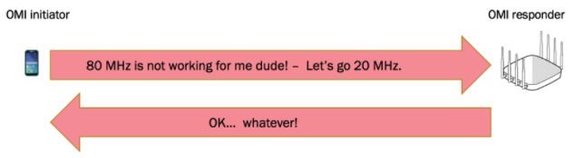

[TOC]

# 序言

**Operating Mode Indication (OMI)**是802.11ax MAC层运行的一种基本机制，用以交互形式分配兼容性以及信道带宽的协商。

参考资料：

- [What is Operating Mode Indication (OMI)?](https://www.extremenetworks.com/extreme-networks-blog/what-is-operating-mode-indication-omi/)。

# Operating Mode Indication (OMI)

在802.11ax中，上行和下行链路都引入了OFDMA技术，以实现802.11ax AP和终端间的多用户通信。当任意节点竞争胜利后，其会发起一次TXOP传输（Transmit Opportunity）。在TXOP期间，AP会利用OFDMA技术，将信道分成一个个资源单元（Resource Units ，RUs），以便可以同时进行多用户传输。

传统的802.11a/b/g/n/ac终端想要传输上行数据时（比如进行TXOP传输），其必须通过竞争。在802.11ax中，终端的上行接入机会是可以被AP进行同步和控制的。那么这里常被问的一个问题，即“802.11ax终端能不能不参与一个OFDMA的上行传输，而做为一个独立终端竞争信道，并进行单独的上行传输? ”

802.11ax为此目的定义了操作模式指示（OMI）过程，802.11ax通过OMI机制完成传输模式的切换。如上图所示，终端作为OMI发起者（OMI Initiator）发送具有OM控制字段的帧给AP，AP作为OMI的响应者（OMI Responder）。

802.11ax终端使用802.11数据使用OM控制字段（OM Control Subfield，其通常位于数据或者管理帧中），其用来指示改变AP的发送或者接收模式。802.11ax终端可以通过发送TOM信息（Transmit Operating Mode）给AP，从而在单用户或多用户UL-OFDMA之间切换。若多用户模式，即根据AP控制进行UL-OFDMA传输，若单用户模式，那么终端就自行竞争，并执行单用户的数据传输。802.11ax的终端可以在上行OFDMA传输期间（UL-OFDMA），暂停并且恢复对AP发送的触发帧（Trigger Frames）反馈。

另外，OMI还可以用作802.11ax终端和AP进行接收模式（Receive Operating Mode ，ROM）的切换。802.11ax终端作为OMI Initiator向AP指示，其支持的下行链路的最大空间流数量和最大的信道带宽。如上图所示，终端会通过发送ROM信息给AP，指示其工作的信道大小从80MHz切换到20MHz。

OMI功能对于802.11ax客户端是可选的。

# Operating Mode Notification frame

操作模式通知帧是VHT类别中的一个action帧，其帧格式如下所示。

category字段值为

VHT Action字段为：

Operation Mode字段为：

STA通过发送该帧，表示当前工作的信道宽度和它可以接收的空间流的数量。
