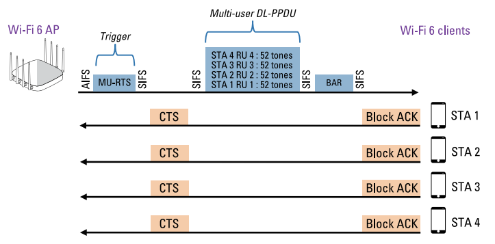

[TOC]

# 序言

在介绍完802.11ax的信道接入以及其触发帧机制后，本文着重介绍下行OFDMA的接入机制（即DL-OFDMA）。

参考资料：[Wi-Fi_6_FD_Extreme_Networks_Special_Edition](/books/Wi-Fi_6_FD_Extreme_Networks_Special_Edition.pdf)

# 下行OFDMA接入机制（DL-OFDMA）

OFDMA是一种多用户通信机制，其只适用于802.11ax AP和802.11ax用户之间的数据帧交换。为了保证协议的兼容，在802.11ax中，管理和控制帧还是按照传统的单用户OFDM进行传输。在此之中，OFDMA和OFDM的工作切换需要进行一系列的特定帧交换，比如之前提到的触发帧（Trigger Frame），这种机制在下行OFDMA（DL-OFDMA）和上行OFDMA（UL-OFDMA）中都需要被引入。

接下来分析一下触发帧（Trigger Frames）机制是如何用户DL-OFDMA通信，即802.11ax AP向802.11ax终端们进行多用户下行传输。

首先，802.11ax AP需要通过竞争（即CSMA/CA的竞争过程），竞争胜利后，其发起一个TXOP传输时间，相当于这一段TXOP时间内，信道都是被AP所预约占据的，其余所有节点都会被延迟。如上图所示，一旦802.11ax AP获得了TXOP传输时间，AP可以给多个目标终端发送MU-RTS帧，这也是一种类型的触发帧。该MU-RTS帧有以下两个目的：

- **预约信道（Reserve the medium）**：MU-RTS采用传统的OFDM技术，在整个20MHz信道上进行传输，所有的节点（包含802.11ax节点和传统的802.11节点）都可以接收。其功能和传统的RTS是类似的。通过该MU-RTS帧中的Duration/ID字段，该帧设置其余所有节点的NAV定时器，在预约时间内（即定时器设置的时间），所有的终端都处于被动接收状态，不会主动竞争信道。NAV定时器设置的时间值用于DL-OFDMA的数据帧交换。在802.11ax AP向802.11ax终端之间进行OFDMA传输时，信道是必须保证空闲的。
- **RU分配（RU allocation）**：MU-RTS还被用来同步802.11终端的RU分配。MU-RTS由于是一种触发帧（Trigger Frames），触发帧内部包含了RU分配对应的字段。802.11ax AP通过MU-RTS作为触发帧，告诉每一个终端其被分配的时频资源（即对应的RU）。当接收到MU-RTS后，终端需要向AP反馈CTS用于确认。

当收到来自于802.11ax终端的CTS后，802.11ax AP将执行一次下行的OFDMA数据传输（如图，即传输Multi-user DL-PPDU部分）。由于AP已经将信道划分成了多个RU，当终端在自己对应的RU上接收数据，并校验成功后，其需要向AP反馈ACK。该ACK还是通过Block-ACK的形式进行反馈的。具体为当传输完成后，AP会等待SIFS时间，然后发送BAR帧（Block ACK Request）向节点请求Block-ACK，然后终端并行反馈Block-ACK。这里反馈ACK还可以采用Automatic Block-ACK（即AutoBA，Auto Block-Ack ）机制。

> 注：在以上传输过程中，CTS和Block-ACK都是并行传输的，这里并行传输实际上还是利用到了MU传输的机制。

当本轮的DL-OFDMA传输完成后，所有节点（包含AP和终端）都需要进行下一次竞争。若802.11ax AP竞争成功，那么可以执行新的一次DL-OFDMA传输。若802.11n/ac的终端竞争成功，那么会执行一次传统的OFDM传输，以此类推。
