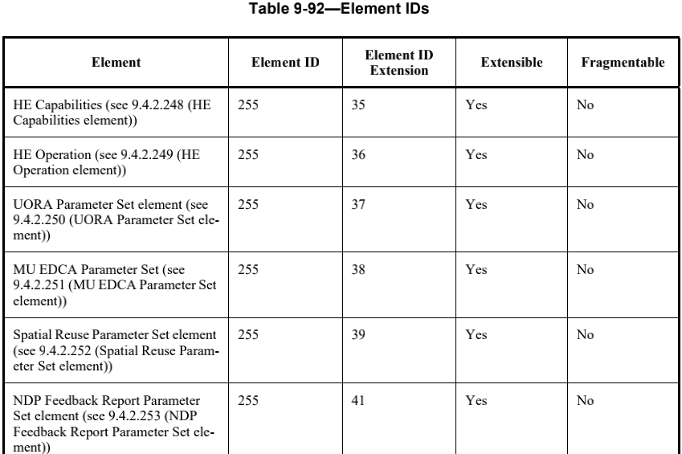
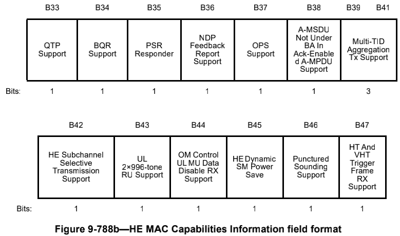

# Element

# HE Capabilities element

HE STA通过发送HE Capabilities element来声明它是HE STA。HE Capabilities element包含许多字段，用于通告HE STA的HE能力。

Element ID:255

Element ID Extension:35

## HE MAC Capabilities Information

| Subfield                                            | Definition                                                   | Encoding                                                     |
| --------------------------------------------------- | ------------------------------------------------------------ | ------------------------------------------------------------ |
| +HTC-HE Support                                     | 表示支持接收带有HE变量HT控制字段的帧                         | 对于非AP的STA： 如果STA支持基于Draft8.0的10.8中描述的HT Control filed operation，设置为1。  对于AP，将该字段设置为1。 |
| TWT Requester Support                               | 表示对TWT请求的支持                                          | 1：dot11TWTOptionActivated为真，并且支持TWT请求 0：不支持 |
| TWT Responder Support                               | 表示对TWT响应的支持                                          | 1：dot11TWTOptionActivated为真，并且支持TWT请求 0：不支持 |
| Dynamic Fragmentation Support                       | STA作为接收者支持的动态分段级别                              | 0：不支持 1：支持1级动态分段整理 2：支持2级动态分段整理 3：支持3级动态分段整理 |
| Maximum Number Of Fragmented MSDUs/A-MSDUs Exponent | STA能够同时接收的最大分段MSDUs/A-MSDU的最大数目（如果接收方支持） | 如果Dynamic Fragmentation Support字段大于0，这个字段会定义MSDUs/A-MSDU的最大分段数目Nmax:,如果该字段的值为7，则表示没有限制 如果Dynamic Fragmentation Support等于0，则该字段保留 |
| Minimum Fragment Size                               | 接收方STA支持的MSDU，A-MSDU（如果支持），MMPDU的第一个片段的最小帧主体（frame body）大小（以字节为单位） | 如果Dynamic Fragmentation Support字段大于0 0：没有最小帧主题大小 1：最小帧主体大小为128字节 2：最小帧主体大小为256字节 3：最小帧主体大小为512字节 如果Dynamic Fragmentation Support等于0，则该字段保留。 |
| Trigger Frame MAC Padding Duration                  | 最小的TrigProcTime（触发帧的填充）                           | 对于非AP的STA： 0：0 1：8us 2：16us 3：保留 对于AP，保留 |
| Multi-TID Aggregation Rx Support                    | HE STA在multi-TIDs A-MSUD中接受的QOS数据帧的TID数量，如26.6.3中所述 | 设置为HE STA可在多TID A-MPDU中传输的TID数量减去QoS数据帧的1  |
| HE Link adaptation Support                          | 使用HLA Control子字段支持链路自适应                          | 如果+HTC-HE Support子字段为1： 0：如果STA不提供HE MFB，设置为0（无反馈） 2：如果STA可以接受和仅提供未经请求的HE MFB（未经请求），设置为2 3：如果STA能够响应HE MRQ接收并提供HE MFB，并且STA可以接受并提供未经请求的HE MFB，则设置为3（请求的和主动的）  ME MFB和ME MRQ分别是使用HLA控制子字段的MFB和MRQ  1：保留 |
| All Ack Support                                     | 支持在all ack上下文接收Multi-STTA BlockAck帧                 | 1：支持 0：不支持                                         |
| TRS Support                                         | 对于非AP STA，支持接收带有TRS Control子字段的帧              | 一个非AP STA，设置+HTC-HE Support的子字段为1： 1：如果STA支持接收带有TRS Control子字段 0：不支持 对于一个AP或者+HTC-HE Support子字段为0，该字段保留。 |
| BSR Support                                         | 对于AP，表示是否支持接收带有BSR Control子字段的帧。 对于非AP的STA，表示是否支持生成带有BSR Control子字段的帧 | 如果+HTC-HE Support子字段为1： 1：如果STA支持BSR Control子字段功能 0：不支持 如果+HTC-HE Support子字段为0，则该字段保留 |
| Broadcast TWT Support                               | 对于非AP STA，表示是否支持TWT调度的STA角色支持。 对于AP，表示是否支持TWT调度AP的角色。 | 1：如果STA支持广播TWT功能 0：其他                         |
| 32-bit BA Bitmap Support                            | 是否支持接收一个Multi-STA Block Ack帧，该帧具有一个AID信息字段和32-bit Block Ack Bitmap子字段 | 1：支持接收一个Multi-STA Block Ack帧，该帧具有一个AID信息字段和32-bit Block Ack Bitmap子字段 0：不支持 |
| MU Cascading Support                                | 是否支持参与MU级联序列                                       | 对于HE AP： 1：表示AP能够在MU级联操作下传输一个按照MU级联操作规则构造的A-MPDU   0：不支持 对于非AP HE STA： 1：表示非AP STA能够接收一个按照MU级联序列规则构造的A-MPDU 0：不支持 |
| Ack-Enabled Aggregation Support                     |                                                              |                                                              |
|                                                     |                                                              |                                                              |
|                                                     |                                                              |                                                              |
|                                                     |                                                              |                                                              |
|                                                     |                                                              |                                                              |
|                                                     |                                                              |                                                              |
|                                                     |                                                              |                                                              |
|                                                     |                                                              |                                                              |
|                                                     |                                                              |                                                              |
|                                                     |                                                              |                                                              |
|                                                     |                                                              |                                                              |
|                                                     |                                                              |                                                              |
|                                                     |                                                              |                                                              |
|                                                     |                                                              |                                                              |
|                                                     |                                                              |                                                              |
|                                                     |                                                              |                                                              |
|                                                     |                                                              |                                                              |
|                                                     |                                                              |                                                              |
|                                                     |                                                              |                                                              |
|                                                     |                                                              |                                                              |
|                                                     |                                                              |                                                              |
|                                                     |                                                              |                                                              |
|                                                     |                                                              |                                                              |
|                                                     |                                                              |                                                              |

