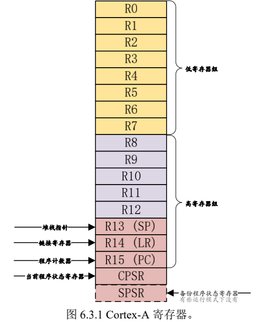
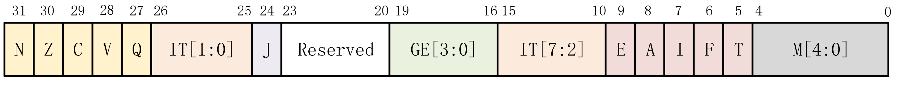
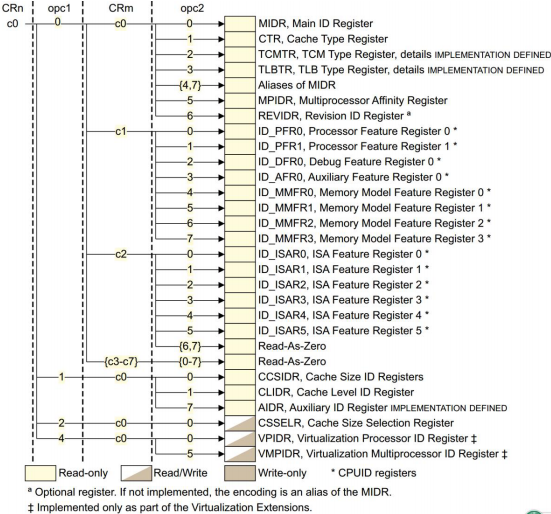
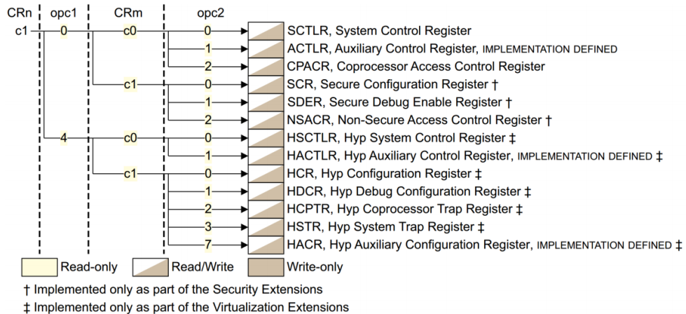
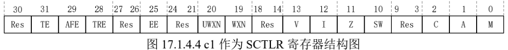

# Cortex-A 处理器运行模型

以前的 ARM 处理器有 7 中运行模型：User、FIQ、IRQ、Supervisor(SVC)、Abort、Undef和 System，其中 User 是非特权模式，其余 6 中都是特权模式。但新的 Cortex-A 架构加入了TrustZone 安全扩展，所以就新加了一种运行模式：Monitor，新的处理器架构还支持虚拟化扩展，因此又加入了另一个运行模式：Hyp，所以 Cortex-A7 处理器有 9 种处理模式，如下表所示：

| 模式            | 描述                                                   |
| --------------- | ------------------------------------------------------ |
| User(USR)       | 用户模式，非特权模式，大部分程序运行的时候就处于此模式 |
| FIQ             | 快速中断模式，进入 FIQ 中断异常                        |
| IRQ             | 一般中断模式                                           |
| Supervisor(SVC) | 超级管理员模式，特权模式，供操作系统使用               |
| Monitor(MON)    | 监视模式？这个模式用于安全扩展模式                     |
| Abort(ABT)      | 数据访问终止模式，用于虚拟存储以及存储保护             |
| Hyp(HYP)        | 超级监视模式？用于虚拟化扩展                           |
| Undef(UND)      | 未定义指令终止模式                                     |
| System(SYS)     | 系统模式，用于运行特权级的操作系统任务                 |

除了 User(USR)用户模式以外，其它 8 种运行模式都是特权模式。这几个运行模式可以通过软件进行任意切换，也可以通过中断或者异常来进行切换。大多数的程序都运行在用户模式，用户模式下是不能访问系统所有资源的，有些资源是受限的，要想访问这些受限的资源就必须进行模式切换。但是用户模式是不能直接进行切换的，用户模式下需要借助异常来完成模式切换，当要切换模式的时候，应用程序可以产生异常，在异常的处理过程中完成处理器模式切换。

当中断或者异常发生以后，处理器就会进入到相应的异常模式种，每一种模式都有一组寄存器供异常处理程序使用，这样的目的是为了保证在进入异常模式以后，用户模式下的寄存器不会被破坏。

# Cortex-A 寄存器组

ARM 架构提供了 16 个 32 位的通用寄存器(R0~R15)供软件使用，前 15 个(R0~R14)可以用作通用的数据存储，R15 是程序计数器 PC，用来保存将要执行的指令。ARM 还提供了一个当前程序状态寄存器 CPSR 和一个备份程序状态寄存器 SPSR，SPSR 寄存器就是 CPSR 寄存器的备份。这 18 个寄存器如下所示：



每一种模式可见的寄存器包括 15 个通用寄存器(R0~R14)、一两个程序状态寄存器和一个程序计数器 PC。在这些寄存器中，有些是所有模式所共用的同一个物理寄存器，有一些是各模式自己所独立拥有的，各个模式所拥有的寄存器如下所示：


其中浅色字体的是与 User 模式所共有的寄存器，蓝绿色背景的是各个模式所独有的寄存器。可以看出，在所有的模式中，低寄存器组(R0~R7)是共享同一组物理寄存器的，只是一些高寄存器组在不同的模式有自己独有的寄存器，比如 FIQ 模式下 R8~R14 是独立的物理寄存器。假如某个程序在 FIQ 模式下访问 R13 寄存器，那它实际访问的是寄存器 R13_fiq，如果程序处于 SVC 模式下访问 R13 寄存器，那它实际访问的是寄存器 R13_svc。总结一下，Cortex-A 内核寄存器组成如下：

①、34 个通用寄存器，包括 R15 程序计数器(PC)，这些寄存器都是 32 位的。

②、8 个状态寄存器，包括 CPSR 和 SPSR。

③、Hyp 模式下独有一个 ELR_Hyp 寄存器。

## 通用寄存器

R0~R15 就是通用寄存器，通用寄存器可以分为以下三类：

①、未备份寄存器，即 R0~R7。

②、备份寄存器，即 R8~R14。

③、程序计数器 PC，即 R15。

### 未备份寄存器 R0-R7

未备份寄存器指的是 R0~R7 这 8 个寄存器，因为在所有的处理器模式下这 8 个寄存器都是同一个物理寄存器，在不同的模式下，这 8 个寄存器中的数据就会被破坏。所以这 8 个寄存器并没有被用作特殊用途。

### 备份寄存器 R8-R14

R8~R12 这 5 个寄存器有两种物理寄存器，在快速中断模式下(FIQ)它们对应着 Rx_fiq(x=8~12)物理寄存器，其他模式下对应着 Rx(8~12)物理寄存器。

FIQ 是快速中断模式，看名字就是知道这个中断模式要求快速执行！ FIQ 模式下中断处理程序可以使用 R8~R12寄存器，因为 FIQ 模式下的 R8~R12 是独立的，因此中断处理程序可以不用执行保存和恢复中断现场的指令，从而加速中断的执行过程。

R13 一共有 8 个物理寄存器，其中一个是用户模式(User)和系统模式(Sys)共用的，剩下的 7 个分别对应 7 种不同的模式。R13 也叫做 SP，用来做为栈指针。基本上每种模式都有一个自己的 R13 物理寄存器，应用程序会初始化 R13，使其指向该模式专用的栈地址，这就是常说的初始化 SP 指针。

R14 一共有 7 个物理寄存器，其中一个是用户模式(User)、系统模式(Sys)和超级监视模式(Hyp)所共有的，剩下的 6 个分别对应 6 种不同的模式。R14 也称为连接寄存器(LR)，LR 寄存器在 ARM 中主要用作如下两种用途：

①、每种处理器模式使用 R14(LR)来存放当前子程序的返回地址，如果使用 BL 或者 BLX 来调用子函数的话，R14(LR)被设置成该子函数的返回地址，在子函数中，将 R14(LR)中的值赋给 R15(PC)即可完成子函数返回，比如在子程序中可以使用如下代码：

```assembly
MOV PC, LR       @ 寄存器 LR 中的值赋值给 PC，实现跳转
```

或者可以在子函数的入口出将 LR 入栈：

```assembly
PUSH {LR}        @ 将 LR 寄存器压栈
```

在子函数的最后面出栈即可：

```assembly
POP {PC}         @ 将上面压栈的 LR 寄存器数据出栈给 PC 寄存器，严格意义上来讲应该是将
                 @ LR-4 赋给 PC，因为 3 级流水线，这里只是演示代码。
```

②、当异常发生以后，该异常模式对应的 R14 寄存器被设置成该异常模式将要返回的地址，R14 也可以当作普通寄存器使用。

### 程序计数器 R15/PC

程序计数器 R15 也叫做 PC，R15 保存着当前执行的指令地址值加 8 个字节，这是因为 ARM的流水线机制导致的。ARM 处理器 3 级流水线：取指->译码->执行，这三级流水线循环执行，比如当前正在执行第一条指令的同时也对第二条指令进行译码，第三条指令也同时被取出存放在 R15(PC)中。我们喜欢以当前正在执行的指令作为参考点，也就是以第一条指令为参考点，那么 R15(PC)中存放的就是第三条指令，换句话说就是 R15(PC)总是指向当前正在执行的指令地址再加上 2 条指令的地址。对于 32 位的 ARM 处理器，每条指令是 4 个字节，所以: 

```assembly
R15 (PC)值 = 当前执行的程序位置 + 8 个字节。
```

### 程序状态寄存器 CPSR

所有的处理器模式都共用一个 CPSR 物理寄存器，因此 CPSR 可以在任何模式下被访问。CPSR 是当前程序状态寄存器，该寄存器包含了条件标志位、中断禁止位、当前处理器模式标志等一些状态位以及一些控制位。所有的处理器模式都共用一个 CPSR 必然会导致冲突，为此，除了 User 和 Sys 这两个模式以外，其他 7 个模式每个都配备了一个专用的物理状态寄存器，叫做 SPSR(备份程序状态寄存器)，当特定的异常中断发生时，SPSR 寄存器用来保存当前程序状态寄存器(CPSR)的值，当异常退出以后可以用 SPSR 中保存的值来恢复 CPSR。

因为 User 和 Sys 这两个模式不是异常模式，所以并没有配备 SPSR，因此不能在 User 和 Sys 模式下访问 SPSR，会导致不可预知的结果。由于 SPSR 是 CPSR 的备份，因此 SPSR 和 CPSR 的寄存器结构相同，如下图所示：



**N(bit31)**：当两个补码表示的 有符号整数运算的时候，N=1 表示运算对的结果为负数，N=0 表示结果为正数。

**Z(bit30)**：Z=1 表示运算结果为零，Z=0 表示运算结果不为零，对于 CMP 指令，Z=1 表示进行比较的两个数大小相等。

**C(bit29)**：在加法指令中，当结果产生了进位，则 C=1，表示无符号数运算发生上溢，其它情况下 C=0。在减法指令中，当运算中发生借位，则 C=0，表示无符号数运算发生下溢，其它情况下 C=1。对于包含移位操作的非加/减法运算指令，C 中包含最后一次溢出的位的数值，对于其它非加/减运算指令，C 位的值通常不受影响。

**V(bit28)**：对于加/减法运算指令，当操作数和运算结果表示为二进制的补码表示的带符号数时，V=1 表示符号位溢出，通常其他位不影响 V 位。

**Q(bit27)**：仅 ARM v5TE_J 架构支持，表示饱和状态，Q=1 表示累积饱和，Q=0 表示累积不饱和。

**IT[1:0] (bit26:25)**：和 IT[7:2] (bit15:bit10)一起组成 IT[7:0]，作为 IF-THEN 指令执行状态。

**J(bit24)**：仅 ARM_v5TE-J 架构支持，J=1 表示处于 Jazelle 状态，此位通常和 T(bit5)位一起表示当前所使用的指令集，如下表所示：

| J    | T    | 描述    |
| ---- | ---- | ------- |
| 0    | 0    | ARM     |
| 0    | 1    | Thumb   |
| 1    | 1    | ThumbEE |
| 1    | 0    | Jazelle |

**GE[3:0] (bit19:16)**：SIMD 指令有效，大于或等于。

**IT[7:2] (bit15:10)**：参考 IT[1:0]。

**E(bit9)**：大小端控制位，E=1 表示大端模式，E=0 表示小端模式。

**A(bit8)**：禁止异步中断位，A=1 表示禁止异步中断。

**I(bit7)**：I=1 禁止 IRQ，I=0 使能 IRQ。

**F(bit6)**：F=1 禁止 FIQ，F=0 使能 FIQ。

**T(bit5)**：控制指令执行状态，表明本指令是 ARM 指令还是 Thumb 指令，通常和 J(bit24)一起表明指令类型，参考 J(bit24)位。

**M[4:0]**：处理器模式控制位，含义下表所示：

| M[4:0] | 处理器模式          |
| ------ | ------------------- |
| 10000  | User 模式           |
| 10001  | FIQ 模式            |
| 10010  | IRQ 模式            |
| 10011  | Supervisor(SVC)模式 |
| 10110  | Monitor(MON)模式    |
| 10111  | Abort(ABT)模式      |
| 11010  | Hyp(HYP)模式        |
| 11011  | Undef(UND)模式      |
| 11111  | System(SYS)模式     |

# 协处理器

## 引言

参考资料：

关 于 CP15 协处理 器和其 相关寄存 器的详细 内容 请参考下 面两份文 档：[ARM ArchitectureReference Manual ARMv7-A and ARMv7-R edition.pdf](/books/ARM_ArchitectureReference_Manual_ARMv7-A_and_ARMv7-R_edition.pdf)第 1469 页“B3.17 Oranization of the CP15 registers in a VMSA implementation”。[Cortex-A7 Technical ReferenceManua.pdf](/books/Cortex-A7_Technical_ReferenceManua.pdf)第55 页“Capter 4 System Control”。

CP15 协处理器一般用于存储系统管理，但是在中断中也会使用到，CP15 协处理器一共有16 个 32 位寄存器。CP15 协处理器的访问通过如下另个指令完成：

**MRC:** 将 CP15 协处理器中的寄存器数据读到 ARM 寄存器中。

**MCR:** 将 ARM 寄存器的数据写入到 CP15 协处理器寄存器中。

MRC 就是读 CP15 寄存器，MCR 就是写 CP15 寄存器，MCR 指令格式如下：

```assembly
MCR{cond} p15, <opc1>, <Rt>, <CRn>, <CRm>, <opc2>

mcr     p15, 0, r0, c1, c0, 0    /* 将r0寄存器中的值写入到CP15的C1寄存器中 */
```

**cond:** 指令执行的条件码，如果忽略的话就表示无条件执行。

**opc1**：协处理器要执行的操作码。

**Rt**：ARM 源寄存器，要写入到 CP15 寄存器的数据就保存在此寄存器中。

**CRn**：CP15 协处理器的目标寄存器。

**CRm**：协处理器中附加的目标寄存器或者源操作数寄存器，如果不需要附加信息就将 CRm 设置为 C0，否则结果不可预测。

**opc2**：可选的协处理器特定操作码，当不需要的时候要设置为 0。

MRC 的指令格式和 MCR 一样，只不过在 MRC 指令中 Rt 就是目标寄存器，也就是从 CP15 指定寄存器读出来的数据会保存在 Rt 中。而 CRn 就是源寄存器，也就是要读取的写处理器寄存器。

假如我们要将 CP15 中 C0 寄存器的值读取到 R0 寄存器中，那么就可以使用如下命令：

```assembly
MRC p15, 0, r0, c0, c0, 0
```

CP15 协处理器有 16 个 32 位寄存器，c0~c15，本章来看一下 c0、c1、c12 和 c15 这四个寄存器，因为我们本章实验要用到这四个寄存器，其他的寄存器大家参考上面的两个文档即可。

## c0 寄存器

CP15 协处理器有 16 个 32 位寄存器，c0~c15，在使用 MRC 或者 MCR 指令访问这 16 个寄存器的时候，指令中的 CRn、opc1、CRm 和 opc2 通过不同的搭配，其得到的寄存器含义是不同的。比如 c0 在不同的搭配情况下含义如下图所示：



当 MRC/MCR 指令中的 CRn=c0，opc1=0，CRm=c0，opc2=0 的时候就表示此时的 c0 就是 MIDR 寄存器，也就是主 ID 寄存器，这个也是 c0 的基本作用。对于 Cortex-A7内核来说，c0 作为 MDIR 寄存器的时候其含义如下图所示：


**bit31:24**：厂商编号，0X41，ARM。

**bit23:20**：内核架构的主版本号，ARM 内核版本一般使用 rnpn 来表示，比如 r0p1，其中 r0 后面的 0 就是内核架构主版本号。

**bit19:16**：架构代码，0XF，ARMv7 架构。

**bit15:4**：内核版本号，0XC07，Cortex-A7 MPCore 内核。

**bit3:0**：内核架构的次版本号，rnpn 中的 pn，比如 r0p1 中 p1 后面的 1 就是次版本号。

## c1 寄存器

c1 寄存器同样通过不同的配置，其代表的含义也不同，如下图所示：



当 MRC/MCR 指令中的 CRn=c1，opc1=0，CRm=c0，opc2=0 的时候就表示此时的 c1 就是 SCTLR 寄存器，也就是系统控制寄存器，这个是 c1 的基本作用。SCTLR 寄存器主要是完成控制功能的，比如使能或者禁止 MMU、I/D Cache 等，c1 作为 SCTLR 寄存器的时候其含义如下图所示：



SCTLR 的位比较多，我们就只看本章会用到的几个位：

**bit13**：V , 中断向量表基地址选择位，为 0 的话中断向量表基地址为 0X00000000，软件可以使用 VBAR 来重映射此基地址，也就是中断向量表重定位。为 1 的话中断向量表基地址为0XFFFF0000，此基地址不能被重映射。

**bit12**：I，I Cache 使能位，为 0 的话关闭 I Cache，为 1 的话使能 I Cache。

**bit11**：Z，分支预测使能位，如果开启 MMU 的话，此位也会使能。

**bit10**：SW，SWP 和 SWPB 使能位，当为 0 的话关闭 SWP 和 SWPB 指令，当为 1 的时候就使能 SWP 和 SWPB 指令。

**bit9:3**：未使用，保留。

**bit2**：C，D Cache 和缓存一致性使能位，为 0 的时候禁止 D Cache 和缓存一致性，为 1 时使能。

**bit1**：A，内存对齐检查使能位，为 0 的时候关闭内存对齐检查，为 1 的时候使能内存对齐检查。

**bit0**：M，MMU 使能位，为 0 的时候禁止 MMU，为 1 的时候使能 MMU。

如果要读写 SCTLR 的话，就可以使用如下命令：

```assembly
MRC p15, 0, <Rt>, c1, c0, 0 ;读取 SCTLR 寄存器，数据保存到 Rt 中。
MCR p15, 0, <Rt>, c1, c0, 0 ;将 Rt 中的数据写到 SCTLR(c1)寄存器中。
```


## c12 寄存器

c12 寄存器通过不同的配置，其代表的含义也不同，如下图所示：


在上图中当 MRC/MCR 指令中的 CRn=c12，opc1=0，CRm=c0，opc2=0 的时候就表示此时 c12 为 VBAR 寄存器，也就是向量表基地址寄存器。设置中断向量表偏移的时候就需要将新的中断向量表基地址写入 VBAR 中，比如在前面的例程中，代码链接的起始地址为0X87800000，而中断向量表肯定要放到最前面，也就是 0X87800000 这个地址处。所以就需要设置 VBAR 为 0X87800000，设置命令如下：

```assembly
ldr r0, =0X87800000          ; r0=0X87800000
MCR p15, 0, r0, c12, c0, 0   ;将 r0 里面的数据写入到 c12 中，即 c12=0X87800000
```

## c15 寄存器

c15 寄存器也可以通过不同的配置得到不同的含义，参考文档[Cortex-A7 Technical ReferenceManua](/books/Cortex-A7_Technical_ReferenceManua.pdf)第 68 页“4.2.16 c15 registers”，其配置如下图所示：


在上图中，我们需要 c15 作为 CBAR 寄存器，因为 GIC 的基地址就保存在 CBAR 中，我们可以通过如下命令获取到 GIC 基地址：

```assembly
MRC p15, 4, r1, c15, c0, 0 ; 获取 GIC 基础地址，基地址保存在 r1 中。
```

获取到 GIC 基地址以后就可以设置 GIC 相关寄存器了，比如我们可以读取当前中断 ID，当前中断 ID 保存在 GICC_IAR 中，寄存器 GICC_IAR 属于 CPU 接口端寄存器，寄存器地址相对于 CPU 接口端起始地址的偏移为 0XC，因此获取当前中断 ID 的代码如下：

```assembly
MRC p15, 4, r1, c15, c0, 0 ;获取 GIC 基地址
ADD r1, r1, #0X2000 ;GIC 基地址加 0X2000 得到 CPU 接口端寄存器起始地址
LDR r0, [r1, #0XC] ;读取 CPU 接口端起始地址+0XC 处的寄存器值，也就是寄存器
                   ;GIC_IAR 的值
```

关于 CP15 协处理器就讲解到这里，简单总结一下，通过 c0 寄存器可以获取到处理器内核信息；通过 c1 寄存器可以使能或禁止 MMU、I/D Cache 等；通过 c12 寄存器可以设置中断向量偏移；通过 c15 寄存器可以获取 GIC 基地址。关于 CP15 的其他寄存器，大家自行查阅本节前面列举的 2 份 ARM 官方资料。

