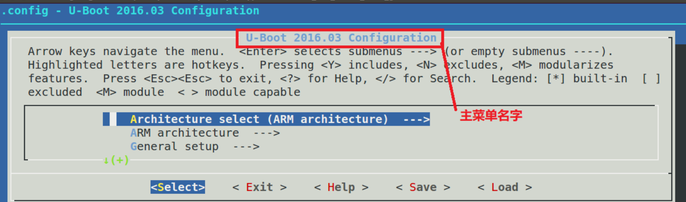
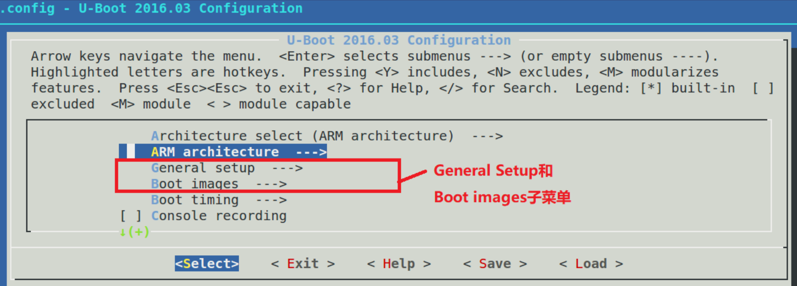
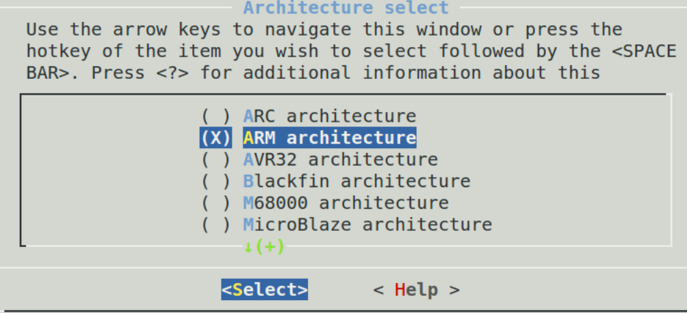
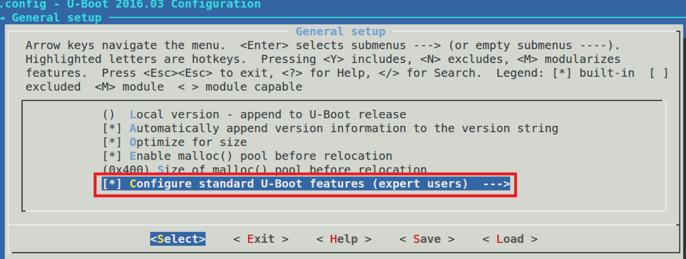
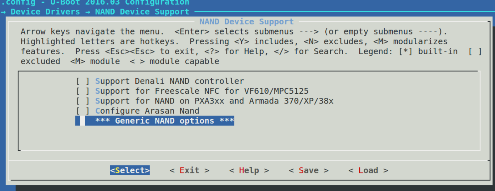

# 配置体验

安装ncurses库

```shell
sudo apt-get install build-essential
sudo apt-get install libncurses5-dev
```

首先需要使用```make xxx_defconfig```进行默认配置，然后再使用```make menuconfig```来对uboot进一步配置。

```shell
make ARCH=arm CROSS_COMPILE=arm-linux-gnueabihf- mx6ull_alientek_emmc_defconfig
make ARCH=arm CROSS_COMPILE=arm-linux-gnueabihf- menuconfig
```

>在menuconfig界面中：
>
>按下Y：将当前选择的编译进uboot
>
>按下N：当前选择的不编译进uboot
>
>按下M：当前选择的编译为模块
>
>按下H或者？：显示当前选项的提示信息

例如使能DNS

“Command line interface --->Network commands --->选中dns

编译烧录uboot

设置dns服务器的IP地址

```shell
setenv dnsip 114.114.114.114
saveenv
```

使用dns命令

```shell
dns www.baidu.com
```

# 原理

当输入 make menuconfig 以后会匹配到顶层 Makefile 的如下代码：

```makefile
%config: scripts_basic outputmakefile FORCE
$(Q)$(MAKE) $(build)=scripts/kconfig $@
```

其中 ```build=-f ./scripts/Makefile.build obj```

所以第一行展开就是```@ make -f ./scripts/Makefile.build obj=scripts/kconfig menuconfig```

Makefile.build 会读取 scripts/kconfig/Makefile 中的内容，在 scripts/kconfig/Makefile 中可以找到如下代码：

```makefile
menuconfig: $(obj)/mconf
						$< $(silent) $(Kconfig)
```

其中obj= scripts/kconfig，silent是设置静默编译的，在这里可以忽略不计，Kconfig=Kconfig，因此扩展以后就是：

```makefile
menuconfig: scripts/kconfig/mconf
scripts/kconfig/mconf Kconfig
```

目标 menuconfig 依赖 scripts/kconfig/mconf，因此 scripts/kconfig/mconf.c 这个文件会被编译，生成 mconf 这个可执行文件。目标 menuconfig 对应的规则为 scripts/kconfig/mconf Kconfig，也就是说 mconf 会调用 uboot 根目录下的 Kconfig 文件开始构建图形配置界面。

# Kconfig语法

## mainmenu

```makefile
mainmenu "U-Boot $UBOOTVERSION Configuration"
```



mainmenu用来配置主菜单名

## source

读取其他目录下的Kconfig

```c
source "xxx/Kconfig" //xxx 为具体的目录名，相对路径
```

## menu/endmenu条目

menu 用于生成菜单，endmenu 就是菜单结束标志，这两个一般是成对出现的

```makefile
menu "General setup"

config LOCALVERSION
	string "Local version - append to U-Boot release"

config LOCALVERSION_AUTO
	bool "Automatically append version information to the version string"
	default y

endmenu		# General setup
```



## 变量类型

Bool:y/n 是否

Tristate:y/m/n 是/模块/否

String：字符串

Help: 表示帮助信息

Default：表示默认值

## Depends on和select

```makefile
config SYS_GENERIC_BOARD
	bool
	depends on HAVE_GENERIC_BOARD

choice
	prompt "Architecture select"
	default SANDBOX

config ARC
	bool "ARC architecture"
	select HAVE_PRIVATE_LIBGCC
	select HAVE_GENERIC_BOARD
	select SYS_GENERIC_BOARD
	select SUPPORT_OF_CONTROL
```

Depends on 说明SYS_GENERIC_BOARD依赖于HAVE_GENERIC_BOARD

select 表示ARC选中后，HAVE_PRIVATE_LIBGCC等也会被选中

## choice/endchoice

```makefile
choice
		prompt "Architecture select"
		default SANDBOX

config ARC
		bool "ARC architecture"
......

config ARM
		bool "ARM architecture"
......

config AVR32
		bool "AVR32 architecture"
......

config BLACKFIN
		bool "Blackfin architecture"
......

config M68K
		bool "M68000 architecture"
......

endchoice
```



定义一组可选项

## menuconfig

带有选项的菜单，只有EXPERT被选中了，里面的选项才会显示出来

```
menu "General setup"

menuconfig EXPERT
		bool "Configure standard U-Boot features (expert users)"
		default y
		
if EXPERT
		config SYS_MALLOC_CLEAR_ON_INIT
		bool "Init with zeros the memory reserved for malloc (slow)"
		default y
endif

endmenu # General setup
```




## comment

用于图形化界面中显示注释

```
config NAND_ARASAN
	bool "Configure Arasan Nand"
	
comment "Generic NAND options"
```



