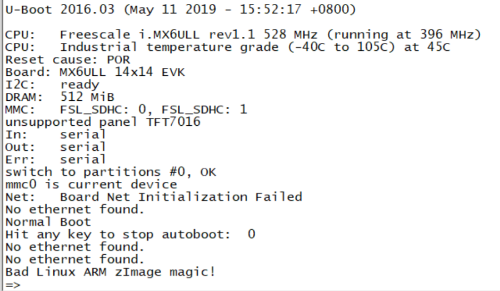
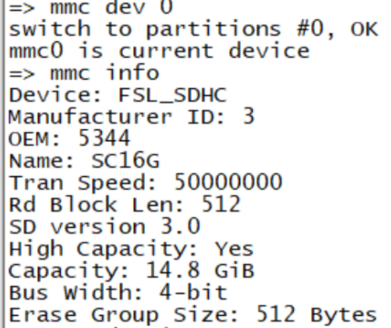

# nxp uboot

## 官方uboot编译

```shell
make ARCH=arm CROSS_COMPILE=arm-linux-gnueabihf- distclean
make ARCH=arm CROSS_COMPILE=arm-linux-gnueabihf- mx6ull_14x14_evk_emmc_defconfig
make V=1 ARCH=arm CROSS_COMPILE=arm-linux-gnueabihf- -j16
```


## uboot烧写

```shell
# 给予 imxdownload 可执行权限
chmod 777 imxdownload 
# 烧写到 SD 卡中，不能烧写到/dev/sda 或 sda1 里面
./imxdownload u-boot.bin /dev/sdd 
```



可以看出uboot可以正常启动

## SD卡和EMMC驱动检查

使用```mmc list```列出当前的MMC设备


检查MMC设备0

```shell
mmc dev 0
mmc info
```

结果如下图所示，mmc设备0是SD卡，SD卡的容量是14.8G，说明SD卡驱动正常



检查MMC设备1

```
mmc dev 1
mmc info
```

mmc 设备 1 为 EMMC，容量为 3.6GB，说明 EMMC 驱动也成功


## LCD驱动检查

屏幕默认是4.3 寸 480x272 分辨率，其他的会有错误

## 网络驱动

uboot启动时有网络驱动错误提示


由于开发板的网络芯片复位引脚和 NXP 官方开发板

## 总结

①、uboot 启动正常，DRAM 识别正确，SD 卡和 EMMC 驱动正常

②、uboot 里面的 LCD 驱动默认是给 4.3 寸 480x272 分辨率的，如果使用的其他分辨率的屏幕需要修改驱动。

③、网络不能工作，识别不出来网络信息，需要修改驱动。

# uboot移植

## 添加开发板默认配置文件

```shell
cd configs
cp mx6ull_14x14_evk_emmc_defconfig mx6ull_alientek_emmc_defconfig
```

然后将文件 mx6ull_alientek_emmc_defconfig 中的内容改成下面的

```
CONFIG_SYS_EXTRA_OPTIONS="IMX_CONFIG=board/freescale/mx6ull_alientek_emmc/imximage.cfg,MX6ULL_EVK_EMMC_REWORK"
CONFIG_ARM=y 
CONFIG_ARCH_MX6=y 
CONFIG_TARGET_MX6ULL_ALIENTEK_EMMC=y 
CONFIG_CMD_GPIO=y
```

## 添加开发板对应的头文件

```shell
cp include/configs/mx6ullevk.h mx6ull_alientek_emmc.h
```

修改文件内容为

```c
/*
 * Copyright (C) 2016 Freescale Semiconductor, Inc.
 *
 * Configuration settings for the Freescale i.MX6UL 14x14 EVK board.
 *
 * SPDX-License-Identifier:	GPL-2.0+
 */
#ifndef __MX6ULL_ALEITENK_EMMC_CONFIG_H
#define __MX6ULL_ALEITENK_EMMC_CONFIG_H


#include <asm/arch/imx-regs.h>
#include <linux/sizes.h>
#include "mx6_common.h"				/* 也有一些配置 */
#include <asm/imx-common/gpio.h>

/* uncomment for PLUGIN mode support */
/* #define CONFIG_USE_PLUGIN */

/* uncomment for SECURE mode support */
/* #define CONFIG_SECURE_BOOT */

#ifdef CONFIG_SECURE_BOOT
#ifndef CONFIG_CSF_SIZE
#define CONFIG_CSF_SIZE 0x4000
#endif
#endif

#define is_mx6ull_9x9_evk()	CONFIG_IS_ENABLED(TARGET_MX6ULL_9X9_EVK)

/* 设置SDRAM大小 */
#ifdef CONFIG_TARGET_MX6ULL_9X9_EVK
#define PHYS_SDRAM_SIZE		SZ_256M
#define CONFIG_BOOTARGS_CMA_SIZE   "cma=96M "
#else
#define PHYS_SDRAM_SIZE		SZ_512M
#define CONFIG_BOOTARGS_CMA_SIZE   ""
/* DCDC used on 14x14 EVK, no PMIC */
#undef CONFIG_LDO_BYPASS_CHECK
#endif

/* SPL options */
/* We default not support SPL
 * #define CONFIG_SPL_LIBCOMMON_SUPPORT
 * #define CONFIG_SPL_MMC_SUPPORT
 * #include "imx6_spl.h"
*/

#define CONFIG_ENV_VARS_UBOOT_RUNTIME_CONFIG

#define CONFIG_DISPLAY_CPUINFO		/* UBOOT启动的时候可以显示CPU信息 */
#define CONFIG_DISPLAY_BOARDINFO	/* uboot启动的时候输出板子的信息 */

/* malloc内存池大小，这里设置为16MB */
#define CONFIG_SYS_MALLOC_LEN		(16 * SZ_1M)

#define CONFIG_BOARD_EARLY_INIT_F		/* 定义后board_init_f函数会调用board_early_init_f函数 */
#define CONFIG_BOARD_LATE_INIT			/* 定义后board_init_r函数会调用board_late_init函数*/

#define CONFIG_MXC_UART					/* 使能串口功能 */
#define CONFIG_MXC_UART_BASE		UART1_BASE		/* 串口基地址，这里使用串口1，基地址为UART1_BASE */

#ifdef CONFIG_FSL_USDHC									/* EMMC接在USDHC2上 */
#define CONFIG_SYS_FSL_ESDHC_ADDR	USDHC2_BASE_ADDR	// EMMC所使用接口的基地址，也就是USDHC2基地址

// NAND接在USDHC2上
// 由于NAND和USDHC2的引脚冲突，所以如果使用NAND的话只能使用一个USDHC设备（SD卡）
#ifdef CONFIG_SYS_USE_NAND								// 如果使用NAND，则只有一个USDHC
#define CONFIG_SYS_FSL_USDHC_NUM	1
#else
#define CONFIG_SYS_FSL_USDHC_NUM	2					// 否则的话，有两个USDHC
#endif
#endif

// I2C配置
#define CONFIG_CMD_I2C
#ifdef CONFIG_CMD_I2C
#define CONFIG_SYS_I2C
#define CONFIG_SYS_I2C_MXC
#define CONFIG_SYS_I2C_MXC_I2C1		/* enable I2C bus 1 */
#define CONFIG_SYS_I2C_MXC_I2C2		/* enable I2C bus 2 */
#define CONFIG_SYS_I2C_SPEED		100000			// I2C速度，32

/* PMIC only for 9X9 EVK */
#define CONFIG_POWER
#define CONFIG_POWER_I2C
#define CONFIG_POWER_PFUZE3000
#define CONFIG_POWER_PFUZE3000_I2C_ADDR  0x08
#endif

#define CONFIG_SYS_MMC_IMG_LOAD_PART	1

// NAND分区设置
#ifdef CONFIG_SYS_BOOT_NAND
#define CONFIG_MFG_NAND_PARTITION "mtdparts=gpmi-nand:64m(boot),16m(kernel),16m(dtb),1m(misc),-(rootfs) "
#else
#define CONFIG_MFG_NAND_PARTITION ""
#endif

// 定义MFGTOOLS烧写系统时用到的环境变量
#define CONFIG_MFG_ENV_SETTINGS \
	"mfgtool_args=setenv bootargs console=${console},${baudrate} " \
	    CONFIG_BOOTARGS_CMA_SIZE \
		"rdinit=/linuxrc " \
		"g_mass_storage.stall=0 g_mass_storage.removable=1 " \
		"g_mass_storage.file=/fat g_mass_storage.ro=1 " \
		"g_mass_storage.idVendor=0x066F g_mass_storage.idProduct=0x37FF "\
		"g_mass_storage.iSerialNumber=\"\" "\
		CONFIG_MFG_NAND_PARTITION \
		"clk_ignore_unused "\
		"\0" \
	"initrd_addr=0x83800000\0" \
	"initrd_high=0xffffffff\0" \
	"bootcmd_mfg=run mfgtool_args;bootz ${loadaddr} ${initrd_addr} ${fdt_addr};\0" \

#if defined(CONFIG_SYS_BOOT_NAND)
#define CONFIG_EXTRA_ENV_SETTINGS \
	CONFIG_MFG_ENV_SETTINGS \
	"panel=TFT7016\0" \
	"fdt_addr=0x83000000\0" \
	"fdt_high=0xffffffff\0"	  \
	"console=ttymxc0\0" \
	"bootargs=console=ttymxc0,115200 ubi.mtd=4 "  \
		"root=ubi0:rootfs rootfstype=ubifs "		     \
		CONFIG_BOOTARGS_CMA_SIZE \
		"mtdparts=gpmi-nand:64m(boot),16m(kernel),16m(dtb),1m(misc),-(rootfs)\0"\
	"bootcmd=nand read ${loadaddr} 0x4000000 0x800000;"\
		"nand read ${fdt_addr} 0x5000000 0x100000;"\
		"bootz ${loadaddr} - ${fdt_addr}\0"

#else
#define CONFIG_EXTRA_ENV_SETTINGS \
	CONFIG_MFG_ENV_SETTINGS \
	"script=boot.scr\0" \
	"image=zImage\0" \
	"console=ttymxc0\0" \
	"fdt_high=0xffffffff\0" \
	"initrd_high=0xffffffff\0" \
	"fdt_file=undefined\0" \
	"fdt_addr=0x83000000\0" \
	"boot_fdt=try\0" \
	"ip_dyn=yes\0" \
	"panel=TFT7016\0" \
	"mmcdev="__stringify(CONFIG_SYS_MMC_ENV_DEV)"\0" \
	"mmcpart=" __stringify(CONFIG_SYS_MMC_IMG_LOAD_PART) "\0" \
	"mmcroot=" CONFIG_MMCROOT " rootwait rw\0" \
	"mmcautodetect=yes\0" \
	"mmcargs=setenv bootargs console=${console},${baudrate} " \
		CONFIG_BOOTARGS_CMA_SIZE \
		"root=${mmcroot}\0" \
	"loadbootscript=" \
		"fatload mmc ${mmcdev}:${mmcpart} ${loadaddr} ${script};\0" \
	"bootscript=echo Running bootscript from mmc ...; " \
		"source\0" \
	"loadimage=fatload mmc ${mmcdev}:${mmcpart} ${loadaddr} ${image}\0" \
	"loadfdt=fatload mmc ${mmcdev}:${mmcpart} ${fdt_addr} ${fdt_file}\0" \
	"mmcboot=echo Booting from mmc ...; " \
		"run mmcargs; " \
		"if test ${boot_fdt} = yes || test ${boot_fdt} = try; then " \
			"if run loadfdt; then " \
				"bootz ${loadaddr} - ${fdt_addr}; " \
			"else " \
				"if test ${boot_fdt} = try; then " \
					"bootz; " \
				"else " \
					"echo WARN: Cannot load the DT; " \
				"fi; " \
			"fi; " \
		"else " \
			"bootz; " \
		"fi;\0" \
	"netargs=setenv bootargs console=${console},${baudrate} " \
		CONFIG_BOOTARGS_CMA_SIZE \
		"root=/dev/nfs " \
	"ip=dhcp nfsroot=${serverip}:${nfsroot},v3,tcp\0" \
		"netboot=echo Booting from net ...; " \
		"run netargs; " \
		"if test ${ip_dyn} = yes; then " \
			"setenv get_cmd dhcp; " \
		"else " \
			"setenv get_cmd tftp; " \
		"fi; " \
		"${get_cmd} ${image}; " \
		"if test ${boot_fdt} = yes || test ${boot_fdt} = try; then " \
			"if ${get_cmd} ${fdt_addr} ${fdt_file}; then " \
				"bootz ${loadaddr} - ${fdt_addr}; " \
			"else " \
				"if test ${boot_fdt} = try; then " \
					"bootz; " \
				"else " \
					"echo WARN: Cannot load the DT; " \
				"fi; " \
			"fi; " \
		"else " \
			"bootz; " \
		"fi;\0" \
		"findfdt="\
			"if test $fdt_file = undefined; then " \
				"setenv fdt_file imx6ull-alientek-emmc.dtb; " \
			"fi;\0" \

// 设置环境变量 bootcmd 的值
#define CONFIG_BOOTCOMMAND \
	   "run findfdt;" \
	   "mmc dev ${mmcdev};" \
	   "mmc dev ${mmcdev}; if mmc rescan; then " \
		   "if run loadbootscript; then " \
			   "run bootscript; " \
		   "else " \
			   "if run loadimage; then " \
				   "run mmcboot; " \
			   "else run netboot; " \
			   "fi; " \
		   "fi; " \
	   "else run netboot; fi"
#endif

/* Miscellaneous configurable options */
// 设置命令memtest相关的宏定义
#define CONFIG_CMD_MEMTEST
#define CONFIG_SYS_MEMTEST_START	0x80000000
#define CONFIG_SYS_MEMTEST_END		(CONFIG_SYS_MEMTEST_START + 0x8000000)

#define CONFIG_SYS_LOAD_ADDR		CONFIG_LOADADDR	// Linux kernel在dram中的加载地址，0x80800000
#define CONFIG_SYS_HZ			1000				// 系统时钟频率，1000hz

#define CONFIG_STACKSIZE		SZ_128K				// 栈大小 128k

/* Physical Memory Map */
#define CONFIG_NR_DRAM_BANKS		1				// dram banks的数量
#define PHYS_SDRAM			MMDC0_ARB_BASE_ADDR		// dram控制MMDC0所管辖的dram范围起始地址，0x80000000

#define CONFIG_SYS_SDRAM_BASE		PHYS_SDRAM		// dram的起始地址，0x80000000
#define CONFIG_SYS_INIT_RAM_ADDR	IRAM_BASE_ADDR	// 内部iram的起始地址，0x00900000
#define CONFIG_SYS_INIT_RAM_SIZE	IRAM_SIZE		// 内部iram大小，0x00040000=128k

// 初试sp偏移
#define CONFIG_SYS_INIT_SP_OFFSET \
	(CONFIG_SYS_INIT_RAM_SIZE - GENERATED_GBL_DATA_SIZE)

// 初试sp地址
#define CONFIG_SYS_INIT_SP_ADDR \
	(CONFIG_SYS_INIT_RAM_ADDR + CONFIG_SYS_INIT_SP_OFFSET)

/* FLASH and environment organization */
#define CONFIG_SYS_NO_FLASH

#ifdef CONFIG_SYS_BOOT_QSPI
#define CONFIG_FSL_QSPI
#define CONFIG_ENV_IS_IN_SPI_FLASH
#elif defined CONFIG_SYS_BOOT_NAND
#define CONFIG_SYS_USE_NAND
#define CONFIG_ENV_IS_IN_NAND
#else
#define CONFIG_FSL_QSPI
#define CONFIG_ENV_IS_IN_MMC
#endif

#define CONFIG_SYS_MMC_ENV_DEV		1				// 默认的mmc设备，USDHC2，也就是emmc
#define CONFIG_SYS_MMC_ENV_PART		0				// 模式分区，默认为第0个分区
#define CONFIG_MMCROOT			"/dev/mmcblk1p2"	// emmc设备的第二个分区      /* USDHC2 */
													// 第0个分区保存uboot
													// 第1个分区保存linux镜像和设备树
													// 第2个分区为Linux系统的根文件系统
#define CONFIG_CMD_BMODE

#ifdef CONFIG_FSL_QSPI
#define CONFIG_QSPI_BASE		QSPI0_BASE_ADDR
#define CONFIG_QSPI_MEMMAP_BASE		QSPI0_AMBA_BASE

#define CONFIG_CMD_SF
#define CONFIG_SPI_FLASH
#define CONFIG_SPI_FLASH_BAR
#define CONFIG_SF_DEFAULT_BUS		0
#define CONFIG_SF_DEFAULT_CS		0
#define CONFIG_SF_DEFAULT_SPEED	40000000
#define CONFIG_SF_DEFAULT_MODE		SPI_MODE_0
#define CONFIG_SPI_FLASH_STMICRO
#endif

/* NAND stuff */
// 与nand有关的定义
#ifdef CONFIG_SYS_USE_NAND
#define CONFIG_CMD_NAND
#define CONFIG_CMD_NAND_TRIMFFS

#define CONFIG_NAND_MXS
#define CONFIG_SYS_MAX_NAND_DEVICE	1
#define CONFIG_SYS_NAND_BASE		0x40000000
#define CONFIG_SYS_NAND_5_ADDR_CYCLE
#define CONFIG_SYS_NAND_ONFI_DETECTION

/* DMA stuff, needed for GPMI/MXS NAND support */
#define CONFIG_APBH_DMA
#define CONFIG_APBH_DMA_BURST
#define CONFIG_APBH_DMA_BURST8
#endif

#define CONFIG_ENV_SIZE			SZ_8K			// 环境变量大小，8K
#if defined(CONFIG_ENV_IS_IN_MMC)				// 如果环境变量保存在EMMC中
#define CONFIG_ENV_OFFSET		(12 * SZ_64K)	// 环境变量便宜地址
#elif defined(CONFIG_ENV_IS_IN_SPI_FLASH)		// 如果环境变量保存在SPIFLASH中
#define CONFIG_ENV_OFFSET		(768 * 1024)
#define CONFIG_ENV_SECT_SIZE		(64 * 1024)
#define CONFIG_ENV_SPI_BUS		CONFIG_SF_DEFAULT_BUS
#define CONFIG_ENV_SPI_CS		CONFIG_SF_DEFAULT_CS
#define CONFIG_ENV_SPI_MODE		CONFIG_SF_DEFAULT_MODE
#define CONFIG_ENV_SPI_MAX_HZ		CONFIG_SF_DEFAULT_SPEED
#elif defined(CONFIG_ENV_IS_IN_NAND)			// 如果环境变量定义在nand中
#undef CONFIG_ENV_SIZE
#define CONFIG_ENV_OFFSET		(60 << 20)
#define CONFIG_ENV_SECT_SIZE		(128 << 10)
#define CONFIG_ENV_SIZE			CONFIG_ENV_SECT_SIZE
#endif


/* USB Configs */
// usb相关的定义
#define CONFIG_CMD_USB
#ifdef CONFIG_CMD_USB
#define CONFIG_USB_EHCI
#define CONFIG_USB_EHCI_MX6
#define CONFIG_USB_STORAGE
#define CONFIG_EHCI_HCD_INIT_AFTER_RESET
#define CONFIG_USB_HOST_ETHER
#define CONFIG_USB_ETHER_ASIX
#define CONFIG_MXC_USB_PORTSC  (PORT_PTS_UTMI | PORT_PTS_PTW)
#define CONFIG_MXC_USB_FLAGS   0
#define CONFIG_USB_MAX_CONTROLLER_COUNT 2
#endif

// 网络相关的定义
#ifdef CONFIG_CMD_NET
#define CONFIG_CMD_PING
#define CONFIG_CMD_DHCP
#define CONFIG_CMD_MII
#define CONFIG_FEC_MXC
#define CONFIG_MII
#define CONFIG_FEC_ENET_DEV		1		// uboot使用的网口，0,用ENET1  1,用ENET2

#if (CONFIG_FEC_ENET_DEV == 0)
#define IMX_FEC_BASE			ENET_BASE_ADDR		// ENET接口的寄存器首地址
#define CONFIG_FEC_MXC_PHYADDR          0x0			// 网口PHY芯片的地址
#define CONFIG_FEC_XCV_TYPE             RMII		// PHY芯片所使用的接口类型
#elif (CONFIG_FEC_ENET_DEV == 1)
#define IMX_FEC_BASE			ENET2_BASE_ADDR
#define CONFIG_FEC_MXC_PHYADDR		0x1
#define CONFIG_FEC_XCV_TYPE		RMII
#endif
#define CONFIG_ETHPRIME			"FEC"

#define CONFIG_PHYLIB
#define CONFIG_PHY_SMSC
#endif

#define CONFIG_IMX_THERMAL

#ifndef CONFIG_SPL_BUILD
#define CONFIG_VIDEO					// 开启LCD
#ifdef CONFIG_VIDEO
#define CONFIG_CFB_CONSOLE
#define CONFIG_VIDEO_MXS
#define CONFIG_VIDEO_LOGO				// 使能LOGO显示
#define CONFIG_VIDEO_SW_CURSOR
#define CONFIG_VGA_AS_SINGLE_DEVICE
#define CONFIG_SYS_CONSOLE_IS_IN_ENV
#define CONFIG_SPLASH_SCREEN
#define CONFIG_SPLASH_SCREEN_ALIGN
#define CONFIG_CMD_BMP					// 使能BMP图片显示指令，这样就可以在uboot中显示图片了，一般用于显示logo
#define CONFIG_BMP_16BPP
#define CONFIG_VIDEO_BMP_RLE8
#define CONFIG_VIDEO_BMP_LOGO
#define CONFIG_IMX_VIDEO_SKIP
#endif
#endif

#define CONFIG_FAT_WRITE /* 使能fatwrite命令 */

#define CONFIG_IOMUX_LPSR

#if defined(CONFIG_ANDROID_SUPPORT)
#include "mx6ullevk_android.h"
#endif

#endif
```

