# 网络制式

网络制式就是网络的类型，我国手机的网络制式有[CDMA手机](https://baike.baidu.com/item/CDMA手机)占用的CDMA 1X，800MHZ频段；

[GSM手机](https://baike.baidu.com/item/GSM手机/9525657)占用的900/1800/1900MHZ 频段；近两年的GSM 1X双模（即WCDMA)占用的900/1800MHZ频段；

3G占用的900/1800/1900/2100MHz频段；

4G占用的1920--2170MHZ频段。联通4GTD LTE占用的2555-2575MHz，2300-2320MHz频段（仅限室内使用）。

## 介绍

手机支持频段，首先应明确频段实质上是硬性划分的，这主要是由频率资源的有限导致， 我国主要由工业和信息化部负责相关事宜。

## 发展

[中国移动](https://baike.baidu.com/item/中国移动)使用的GSM(2G)/[TD-SCDMA](https://baike.baidu.com/item/TD-SCDMA)(3G)/TD-LTE(4G)这3模；

[中国联通](https://baike.baidu.com/item/中国联通)使用的是GSM(2G)/[WCDMA](https://baike.baidu.com/item/WCDMA)(3G)/TD-LTE(4G)/FDD-LTE(4G)；

[中国电信](https://baike.baidu.com/item/中国电信)使用的是CDMA1X(2G)/EVDO(3G)/TD-LTE(4G)/FDD-LTE(4G)。

对于国内的运营商来说，只要达到7模即可称之为全网通机型。

1G（first generation）表示第一代移动通讯技术。在20世纪80年代前期，第一代模拟制式技术(1G)首次出现，其作为蜂窝电话的标准，特点是仅限语音。现如今，模拟蜂窝技术己然退出了历史舞台。

2G（second generation）表示第二代移动通讯技术，第二代GSM数字制式。数字信令与数字语音信道是其鲜明特点。

2.5G是基于2G与3G之间的过渡类型。比2G在速度、[带宽](https://baike.baidu.com/item/带宽)上有所提高。可使现有GSM网络轻易地实现与高速数据分组的简便接入。

已经进行商业应用的2.5G（Generation）[移动通信技术](https://baike.baidu.com/item/移动通信技术)是从2G迈向3G的衔接性技术，突破了2G电路交换技术对[数据传输速率](https://baike.baidu.com/item/数据传输速率)的制约，引入了[分组交换技术](https://baike.baidu.com/item/分组交换技术)，从而使数据传输速率有了质的突破，是一种介于2G与3G之间的过渡技术。2.5G的出现主要是由于3G是个相当浩大的工程，所牵扯的层面较多且复杂，要从2G一下迈向3G是不可能马上实现的。代表为：GPRS， HSCSD、WAP、EDGE、蓝牙(Bluetooth)、EPOC等技术。

3G是英文3rd Generation的缩写，指[第三代移动通信技术](https://baike.baidu.com/item/第三代移动通信技术)。第三代手机一般是指将无线通信与国际互联网等多媒体通信结合的新一代[移动通信系统](https://baike.baidu.com/item/移动通信系统)。它能够方便、快捷的处理图像、音乐、[视频流](https://baike.baidu.com/item/视频流)等多种媒体形式，提供包括[网页](https://baike.baidu.com/item/网页)浏览、[电话会议](https://baike.baidu.com/item/电话会议)、电子商务等多种信息服务。为手机融入[多媒体元素](https://baike.baidu.com/item/多媒体元素)提供强大的支持。

4G是第四代移动通信网络制式技术。第四代移动通信技术采用了更多以前没有使用过的新技术，引入了技术层面的交流，主要采用基于路由技术的网络体系结构，通过使用无限频率技术，从而让其系统比前面两代都更加完美。用较少数量的无线频谱就能做和以前一样的事情，且速度仍能保持相对快速。第四代[移动通信系统](https://baike.baidu.com/item/移动通信系统)的关键技术包括信道传输；抗干扰性强的高速接入技术、调制和[信息传输技术](https://baike.baidu.com/item/信息传输技术)；高性能、小型化和低成本的自适应阵列智能天线；大容量、低成本的无线接口和光接口；系统管理资源；软件无线电、网络结构协议等。[第四代移动通信](https://baike.baidu.com/item/第四代移动通信/22327281)系统主要是以正交频分复用（OFDM）为技术核心。

4G移动通信对加速增长的[广带](https://baike.baidu.com/item/广带)无线连接的要求提供技术上的回应，对跨越公众的和专用的、室内和室外的多种无线系统和网络保证提供无缝的服务。通过对最适合的可用网络提供用户所需求的最佳服务，能应付基于因特网通信所期望的增长，增添新的频段，使频谱资源大扩展，提供不同类型的[通信接口](https://baike.baidu.com/item/通信接口)，运用[路由技术](https://baike.baidu.com/item/路由技术)为主的网络架构，以傅利叶变换来发展硬件架构实现第四代网络架构。移动通信将向数据化，高速化、宽带化、频段更高化方向发展，移动数据、移动IP将成为未来移动网的主流业务。

5G是[第五代移动通信](https://baike.baidu.com/item/第五代移动通信/20466219)网络制式。第五代移动通信网络制式的下载速度及上传速度将比第四代快几十倍。其设计理念更加强调的是耗能低的同时满足其效率最大化，而且将继续提高智能化水平及广域覆盖度。通过提高感应的能力，5G会带给用户全新的体验。

## 手机网络制式

### 网络制式-模

“模”就是手机的网络制式，中国有三大运营商，而且[中国移动](https://baike.baidu.com/item/中国移动/237216)采用了由我国自主研发的TD技术网络，所以[手机网络制式](https://baike.baidu.com/item/手机网络制式/2063550)显得更加繁多。

中国移动网络制式为2G：GSM制式；3G：TD-SCDMA制式；4G：TD-LTE制式。

中国联通网络制式为2G：GSM制式； 3G：WCDMA制式；4G：TD-LTE和FDD-LTE混合制式。

中国电信网络制式为2G：CDMA制式；3G：CDMA2000制式；4G：TD-LTE和FDD-LTE混合制式。

### 网络制式-频

网络制式的[频率](https://baike.baidu.com/item/频率/19505)，指的是每种网络[频段](https://baike.baidu.com/item/频段)的不同，国家都划分了几个不同的频段，让他们运行在不同的频段上，互相不干扰。

我们将不同手机网络的[模](https://baike.baidu.com/item/模/13332717)比喻成收音机的不同的台，我们知道收音机的每一个台都对应一个单独的频率，而手机网络不同的模也对应的频率段范围。国家划分了几个不同的频段，让他们运行在不同的频段上，井然有序互不干扰。

手机支持频率越多，支持的网络就更多，手机的[漫游](https://baike.baidu.com/item/漫游/4025564)性就越好。比如中国的[4G手机](https://baike.baidu.com/item/4G手机)，在中国运行在1900[MHz](https://baike.baidu.com/item/MHz)这个频率上，当手机漫游到美国的时候，可能需要 运行在2200MHz频率上，到法国又可能需要运行在1800MHz这个频率上。所以手机对多种频率的支持显得尤为重要。

### GSM频段

我国[GSM手机](https://baike.baidu.com/item/GSM手机/9525657)占用频段主要是900MHZ和1800MHZ。实质上1800MHZ也是由于手机用户数量 的激增，造成了手机通信网络系统处于超负荷运转状态，最终导致了手机在通信时很容易出现类似于 [掉线](https://baike.baidu.com/item/掉线)、串音、话音质量不好、难以上网等故障现象。为了解决这些故障现象，越来越多的手机运营商 和生产商开始意识到解决这个问题的迫切性，并不断采取相关措施来进一步扩容手机网络系统，于是 GSM1800Mhz便应运而生了，又被称为DCS1800（[数字蜂窝系统](https://baike.baidu.com/item/数字蜂窝系统/16687887)），它的出现使基于GSM900、1800的双频网络变为现实。使用GSM900/GSM1800双频手机，用户可以在GSM900与GSM1800之间自由切换，可以有效地避免以往易掉线、通话难和音质差等问题，较以前只使用GSM900网的通话更加方便。

### CDMA频段

CDMA 1X：CDMA 1X采用扩频速率为SR1，即指前向信道和反向信道均用码片速率 1.2288Mbit/s的单载波直接系列扩频方式。因此它可以方便地与IS-95（A/B）后向兼容，实现平滑 过渡。由于CDMA 1X采用了反向相干解调、快速前向功控、发送分集、Turbo编码等新技术，其容量比 IS-95大为提高。在相同条件下，对普通话音业务而言，容量大致为IS-95系统的两倍。CDMA 1X网络 可以作为话音业务的承载平台，也可以作为无线接入Internet[分组数据](https://baike.baidu.com/item/分组数据)承载平台，既可以为用户提 供传统的话音业务，也可以为用户提供端对端分组传输模式的数据业务。

CDMA 800MHZ：联通在初建CDMA网络之时，正逢电信长城移交给联通，使联通轻松获得了800MHz 频段上的双向10M频率资源，而这就使联通具有了宝贵的频率资源。因此，联通就利用其在800MHZ频段上的资源建立了CDMA网络。

CDMA网络是由联通统一建设和运营，这一独家运营权所能带来的市场空间也是很明显的。有了 CDMA网的支持，联通可以实现许多新的[增值数据业务](https://baike.baidu.com/item/增值数据业务/12754441)，由此可能会赢得更多CDMA用户。

手机制式主要包括GSM、CDMA、3G三种，手机自问世，经历了第一代模拟制式手机（1G） 、第二代GSM、TDMA等数字手机（2G）、第2.5代[移动通信技术](https://baike.baidu.com/item/移动通信技术)CDMA和[第三代移动通信技术](https://baike.baidu.com/item/第三代移动通信技术)3G。

### GSM数字网

GSM：GSM(Global System For Mobile Communication)网即[全球移动通信系统](https://baike.baidu.com/item/全球移动通信系统)，又称 “全球通”，很多公司参与了标准的制定工作。GSM[数字移动通信系统](https://baike.baidu.com/item/数字移动通信系统)是由欧洲主要电信运营者和 制造厂家组成的标准化委员会设计出来的，它是在蜂窝系统的基础上发展而成。我国自1994年底开始， 在十多个省市筹建GSM[蜂窝移动通信](https://baike.baidu.com/item/蜂窝移动通信)网，其发展势头世人皆叹，到GSM数字网已覆盖全国30多个省 (区、市)，300多个地区和2000多个县市，并可与40多个国家实现漫游。

GSM采用的是数字调制技术，其关键技术之一是时分多址(每个用户在某一时隙上选用载频且只能在特 定时间下收信息)，[GSM系统](https://baike.baidu.com/item/GSM系统)有几项重要特点：防盗拷能力佳、[网络容量](https://baike.baidu.com/item/网络容量)大、号码资源丰富、通话清晰、 稳定性强不易受干扰、信息灵敏、通话死角少、手机耗电量低等。因此其话音清晰，保密容易，能提 供的数据传输服务较多。GSM网能支持的[用户数量](https://baike.baidu.com/item/用户数量)为模拟网的1.8-2倍。

由于GSM发展极快，在其900MHZ频段满以后，又开辟了GSMl800频段，手机工作在900MHZ和1．8GHZ频 段以及GSM1900MHz等几个频段。

### GPRS

GPRS是General Packet Radio Service的英文简称，中文为[通用无线分组业务](https://baike.baidu.com/item/通用无线分组业务)，是一种基于 GSM系统的无线[分组交换技术](https://baike.baidu.com/item/分组交换技术)，提供端到端的、广域的无线IP连接。相对原来GSM的拨号方式的电路 交换[数据传送](https://baike.baidu.com/item/数据传送)方式，GPRS是分组交换技术，具有“实时在线”、“按量计费”、“快捷登录”、 “高速传输”、“自如切换”的优点。通俗地讲，GPRS是一项高速数据处理的技术，方法是以“分组” 的形式传送资料到用户手上。虽然GPRS是作为现有GSM网络向[第三代移动通信](https://baike.baidu.com/item/第三代移动通信)过渡的过渡技术，但是 它在许多方面都具有显著的优势。

### TDMA

TDMA是Time Division Multiple Access的缩写，这是一种用Time－Division Multiplexing （时分多址）来提供无线数字服务的技术，它代表的是一种移动电话系统的数字信号传输技术。TDMA 把一个射频分成多个时隙，再把这些时隙分给多组通话。这样，一个射频可以同时支持多个数据频道， 该技术已成为的[D-AMPS](https://baike.baidu.com/item/D-AMPS)和GSM系统的基础。

### CDMA数字网

CDMA是码分多址的英文缩写（Code Division Multiple Access），它是在[数字技术](https://baike.baidu.com/item/数字技术)的分 支－－扩频通信技术上发展起来的一种崭新而成熟的无线通信技术。它能够满足市场对移动通信容量 和品质的高要求，具有频谱利用率高、话音质量好、保密性强、掉话率低、电磁辐射小、容量大、覆 盖广等特点，可以大量减少投资和降低运营成本。

业内运营者们正努力在他们的系统中增加[用户数量](https://baike.baidu.com/item/用户数量)，降低每位用户的费用，创造更大的利润并积极加 强市场渗透。[码分多址技术](https://baike.baidu.com/item/码分多址技术)就是解决这一问题的[数字通信技术](https://baike.baidu.com/item/数字通信技术)之一。

其优势为：

高效的频带利用率和更大的[网络容量](https://baike.baidu.com/item/网络容量)

简化网络规化

提高通话质量

增强保密性

提高覆盖特性

延长用户通话时间

软音量和“软”切换

# 移动通信技术的发展

## 第一代通信技术—1G时代：“大哥大”横行

1986年，第一套移动通讯系统在美国芝加哥诞生，采用模拟讯号传输，模拟式为代表在无线传输采用模拟式的FM调制，将介于300Hz到3400Hz的语音转换到高频的载波频率MHz上。此外，1G只能应用在一般语音传输上，且语音品质低、讯号不稳定、涵盖范围也不够全面。

1G主要系统为AMPS，另外还有NMT及TACS，该制式在加拿大、南美、澳洲以及亚太地区广泛采用，而国内在80年代初期移动通信产业还属于一片空白，直到1987年的广东第六届全运会上蜂窝移动通信系统正式启动。

在第1代行动通信系统在国内刚刚建立的时候，我们很多人手中拿的还是大块头的摩托罗拉8000X，俗称大哥大（一般人可用不起哟！）。那个年代虽然没有现在的移动、联通和电信，却有着A网和B网之分，而在这两个网背后就是主宰模拟时代的爱立信和摩托罗拉。

1G中网络制式A网B网区别

1G时期，我国的移动电话公众网由美国摩托罗拉移动通信系统和瑞典爱立信移动通信系统构成。经过划分，摩托罗拉设备使用A频段，称之为A系统；爱立信设备使用B频段，称之为B系统。移动通信的A、B两个系统即是人们常说的A网和B网。

模拟通信系统有着很多缺陷，经常出现串号、盗号等现象。1999年A网和B网被正式关闭，2G时代悄然来临。

## 第二代通信技术—2G：诺基亚崛起时代

到了1995年，新的通讯技术成熟，国内也在中华电信的引导下，正式挥别了1G，进入了2G的通讯时代。从1G跨入2G则是从模拟调制进入到数字调制，相较而言，第二代移动通信具备高度的保密性，系统的容量也在增加，同时从这一代开始手机也可以上网了。

2G声音的品质较佳，比1G多了数据传输的服务，数据传输速度为每秒9.6——14.4Kbit，最早的文字简讯也从此开始。

GSM在1990年由欧洲发展出来，另外还有TDMA、CDMA、PDC与iDEN。第一款支持WAP的GSM手机是诺基亚7110，它的出现标志着手机上网时代的开始，而那个时代GSM的网速仅有9.6KB/s。

2G时代也是移动通信标准争夺的开始，，GSM脱颖而出成为最广泛采用的移动通信制式。早在1989年欧洲就以GSM为通信系统的统一标准并正式商业化，同时在欧洲起家的诺基亚和爱立信开始攻占美国和日本市场，仅仅10年功夫诺基亚就成为全球最大的移动电话商。

2G主流的几个网络制式

- GSM：全球移动通信系统（Global System for Mobile Communication），是当前应用最为广泛的移动电话标准，较之以前的标准最大的不同是它的信令和语音信道都是数字式的。GSM是一个当前由3GPP开发的开放标准。

- TDMA：时分多址(Time Division Multiple Access)，是把时间分割成周期性的帧(Frame)，每一个帧再分割成若干个时隙向基站发送信号，在满足定时和同步的条件下，基站可以分别在各时隙中接收到各移动终端的信号而不混扰。同时，基站发向多个移动终端的信号都按顺序安排在预定的时隙中传输，各移动终端只要在指定的时隙内接收，就能在合路的信号中把发给它的信号区分并接收下来。

- CDMA：码分多址(Code Division Multiple Access)，是在数字技术的分支--扩频通信技术上发展起来的一种崭新而成熟的无线通信技术。CDMA技术的原理是基于扩频技术，即将需传送的具有一定信号带宽信息数据，用一个带宽远大于信号带宽的高速伪随机码进行调制，使原数据信号的带宽被扩展，再经载波调制并发送出去。接收端使用完全相同的伪随机码，与接收的带宽信号作相关处理，把宽带信号换成原信息数据的窄带信号即解扩，以实现信息通信。

主要的第二代手机通信技术规格标准有：

- [GSM](https://zh.wikipedia.org/wiki/GSM)：以TDMA为基础所发展、源于欧洲、目前已全球化。

- [IDEN](https://zh.wikipedia.org/wiki/IDEN)：以TDMA为基础所发展、[美国](https://zh.wikipedia.org/wiki/美國)独有的系统。被美国电信系统商[Nextell](https://zh.wikipedia.org/w/index.php?title=Nextell&action=edit&redlink=1)使用。

- IS-136﹙也叫做[D-AMPS](https://zh.wikipedia.org/wiki/D-AMPS)﹚：基于TDMA所发展，是美国最简单的TDMA系统，用于[美洲](https://zh.wikipedia.org/wiki/美洲)。

- IS-95﹙也叫做[cdmaOne](https://zh.wikipedia.org/wiki/CdmaOne)﹚：基于CDMA所发展、是美国最简单的CDMA系统、用于美洲和亚洲一些国家。

- [PDC](https://zh.wikipedia.org/wiki/PDC)﹙Personal Digital Cellular﹚：基于TDMA所发展，仅在[日本](https://zh.wikipedia.org/wiki/日本)普及。

## 第三代通信技术—3G：CDMA大行其道

随着人们对移动网络的需求不断加大，第3代移动通信网络必须在新的频谱上制定出新的标准，享用更高的数据传输速率。

在3G之下，有了高频宽和稳定的传输，影像电话和大量数据的传送更为普遍，行动通讯有更多样化的应用，因此3G被视为是开启行动通讯新纪元的重要关键。而支持3G网络的平板电脑也是在这个时候出现，苹果，联想和华硕等都推出了一大批优秀的平板产品。

中国于2009年的1月7日颁发了3张3G牌照，分别是中国移动的TD-SCDMA，中国联通的WCDMA和中国电信的WCDMA2000。

3G的几个主流标准制式

- WCDMA
- CDMA2000
- TD-SCDMA
- WiMAX

CDMA是第三代移动通信系统的技术基础。CDMA系统以其频率规划简单、系统容量大、频率复用系数高、抗多径能力强、通信质量好、软容量、软切换等特点显示出巨大的发展潜力。

世界上主流的3G规格为WCDMA与CDMA2000系列，另外还有中国移动主推的TD-SCDMA。美、加、澳、韩以及日本KDDI采用CDMA 2000系列。

## 第四代通信技术—4G：无线蜂窝电话协议

4G是指第四代无线蜂窝电话通讯协议，是集3G与WLAN于一体并能够传输高质量视频图像以及图像传输质量与高清晰度电视不相上下的技术产品。4G系统能够以100Mbps的速度下载，比拨号上网快2000倍，上传的速度也能达到20Mbps。

2013年12月，工信部在其官网上宣布向中国移动、中国电信、中国联通颁发“LTE/第四代数字蜂窝移动通信业务(TD-LTE)”经营许可，也就是4G牌照。至此，移动互联网的网速达到了一个全新的高度。

如今4G信号覆盖已非常广泛，支持TD-LTE、FDD-LTE的手机、平板产品越来越多，很多平板，并成为标配，支持通话功能、网络的Android、Win系统平板也非常常见。

4G的主要网络制式

LTE是基于OFDMA技术、由3GPP组织制定的全球通用标准，包括TDD（时分双工）和FDD（频分双工）两种模式，二者相似度达90%，差异较小。

TD-LTE：TDD版本的LTE技术，分时长期演进（Time Division Long Term Evolution），由3GPP组织涵盖的全球各大企业及运营商共同制定。

FDD-LTE:FDD版本的LTE技术。由于无线技术的差异、使用频段的不同以及各个厂家的利益等因素，FDD-LTE的标准化与产业发展都领先于TD-LTE，成为当前世界上采用的国家及地区最广泛的，终端种类最丰富的一种4G标准。

## 第五代通信技术—5G：高可靠体验

5G，即第五代移动通信技术，国际电联将5G应用场景划分为移动互联网和物联网两大类。

5G呈现出低时延、高可靠、低功耗的特点，已经不再是一个单一的无线接入技术，而是多种新型无线接入技术和现有无线接入技术（4G后向演进技术）集成后的解决方案总称。

可以看到，是车联网、物联网带来的庞大终端接入、数据流量需求，以及种类繁多的应用体验提升需求推动了5G的研究。无线通信技术通常每10年更新一代，2000年3G开始成熟并商用，2010年4G开始成熟并商用，现在研究5G，2020年成熟应该是符合规律预期的，5G的诞生，将进一步改变我们的生活。

# USIM

[USIM](https://baike.baidu.com/item/USIM)是**Universal Subscriber Identity Module**（全球用户识别卡）的缩写。全球[用户身份模块](https://baike.baidu.com/item/用户身份模块/10627500)(USIM)，也叫做升级SIM ，是在UMTS（全称为Universal Mobile Telecommunication System -- 通用无线通信系统） 3G 网络的一个构件。除能够支持多应用之外，USIM卡还在安全性方面对算法进行了升级，并增加了卡对网络的认证功能，这种双向认证可以有效防止黑客对卡片的攻击。该技术可以作为[GSM](https://baike.baidu.com/item/GSM/210860)网络的另一种高速数据业务载体，它将成为第二代到第三代移动通信SIM卡良好过渡的技术依托，该技术早在1991年就被提出来作为研究方向，UMTS除支持现有的一些固定和移动业务外，还提供全新的[交互式多媒体](https://baike.baidu.com/item/交互式多媒体/5349314)业务。UMTS使用ITU分配的、用于陆地和卫星无线通信的频带。它可通过移动或固定、公用或[专用网络](https://baike.baidu.com/item/专用网络/795899)接入，与GSM和IP兼容。

# 3G

一种第三代（3G）移动电话技术。它使用WCDMA作为底层标准，由[3GPP](https://baike.baidu.com/item/3GPP)定型，代表欧洲对ITU[IMT-2000](https://baike.baidu.com/item/IMT-2000)关于3G蜂窝无线系统需求的回应。UMTS有时也叫3GSM，强调结合了3G技术而且是[GSM](https://baike.baidu.com/item/GSM)标准的后续标准。UMTS[分组交换](https://baike.baidu.com/item/分组交换/1193080)系统是由GPRS系统所演进而来，故系统的架构颇为相像。

# 4G

**USIM卡**（英语：**UMTS** **S**ubscriber **I**dentity **M**odule），是用于[UMTS](https://zh.wikipedia.org/wiki/UMTS)网络中的用户身份识别模块。USIM卡还可以存储用户资料、[电话](https://zh.wikipedia.org/wiki/電話)号码、认证资料及为[短信](https://zh.wikipedia.org/wiki/短訊)提供存储空间。

USIM卡通常被认为是[SIM](https://zh.wikipedia.org/wiki/SIM)卡的升级，在[LTE](https://zh.wikipedia.org/wiki/LTE)网络中必须使用USIM卡，同时USIM卡兼容2G、3G网络。

当用户需在外国使用[漫游](https://zh.wikipedia.org/wiki/漫遊)服务时，可以把原用的USIM卡插入对应该地制式，及兼容此USIM卡的手机以使用漫游服务。

为提供认证服务，USIM卡存储一组长期的[加密钥匙](https://zh.wikipedia.org/wiki/密钥)K，与网络的认证中心（AuC）共享。USIM卡亦认证一串连续数字，这些数字不可超过一个范围，以避免被[重放攻击](https://zh.wikipedia.org/wiki/重放攻击)。

# WCDMA、CDMA2000、TDS-CDMA

CDMA和WCDMA其实是两个完全不同的概念，WCDMA是平时我们说的3G的一个网络标准，它可以向下兼容2G和GSM网络。　　3G是英文3rd Generation的缩写，指第三代移动通信技术。相对第一代模拟制式手机(1G)和第二代GSM、TDMA等数字手机(2G)，第三代手机一般地讲，是指将无线通信与国际互联网等多媒体通信结合的新一代移动通信系统。它能够处理图像、音乐、视频流等多种媒体形式，提供包括网页浏览、电话会议、电子商务等多种信息服务。为了提供这种服务，无线网络必须能够支持不同的数据传输速度，也就是说在室内、室外和行车的环境中能够分别支持至少2Mbps(兆字节／每秒)、384kbps(千字节／每秒)以及144kbps的传输速度。　　而CDMA是码分多址(Code-Division Multiple Access)技术的缩写，它能够满足市场对移动通信容 量和品质的高要求，具有频谱利用率高、话音质量好、保密性强、掉话率低、电磁辐射小、容量大、覆覆盖广等特点，可以大量减少投资和降低运营成本。CDMA最早由美国高通公司推出，与GSM相同，CDMA也有2代、2.5代和3代技术。中国联通将于今年下半年推出的CDMA属于2.5代技术。CDMA被认为是第3代移动通信技术的首选，目前的标准有WCDMA(中国移动将采用)、CDMA2000(中国联通将采用)、TD-SCDMA(中国自己发明的)。

WCDMA是平时我们说的3G的一个网络标准，它可以向下兼容2G和GSM网络。

3G是英文3rd Generation的缩写，指第三代移动通信技术。相对第一代模拟制式手机(1G)和第二代GSM、TDMA等数字手机(2G)，第三代手机一般地讲，是指将无线通信与国际互联网等多媒体通信结合的新一代移动通信系统。它能够处理图像、音乐、视频流等多种媒体形式，提供包括网页浏览、电话会议、电子商务等多种信息服务。为了提供这种服务，无线网络必须能够支持不同的数据传输速度，也就是说在室内、室外和行车的环境中能够分别支持至少2Mbps(兆字节／每秒)、384kbps(千字节／每秒)以及144kbps的传输速度。

# GSM和UMTS

**通用移动通讯系统**（Universal Mobile Telecommunications System，缩写：**UMTS**）是当前最广泛采用的一种第三代（[3G](https://zh.wikipedia.org/wiki/3G)）[移动电话](https://zh.wikipedia.org/wiki/移动电话)技术。它的无线接口使用W-CDMA技术，由[3GPP](https://zh.wikipedia.org/wiki/3GPP)制定，代表欧洲对[ITU](https://zh.wikipedia.org/wiki/国际电信联盟) [IMT-2000](https://zh.wikipedia.org/wiki/IMT-2000)关于[3G](https://zh.wikipedia.org/wiki/3G)蜂窝无线系统需求的回应。

UMTS有时也叫3GSM，强调结合了3G技术而且是[GSM](https://zh.wikipedia.org/wiki/全球移动通信系统)标准的后续标准。UMTS分组交换系统是由[GPRS](https://zh.wikipedia.org/wiki/GPRS)系统所演进而来，故系统的架构颇为相像。**UTMS系统**其实就是WCDMA/GSM系统双制式手机，可以同时插入WCDMA手机的UIM卡和[GSM手机](https://baike.baidu.com/item/GSM手机/9525657)的SIM卡.或者TD-SCDMA/GSM双制式手机。

# USAT

USAT技术是在原来SIM卡被动式的操作模式基础上,增加了SIM卡新的主动式操作的能力,即允许SIM卡中的应用和服务主动与手机终端进行交互操作.在USAT技术获得广泛应用之前,手机与SIM卡之间是一种不对称的主从关系,即SIM卡只能处于被动的接受手机的指令并执行的地位,手机则处于绝对的主动控制地位.任何一个动作只能由手机发起命令,并由SIM卡响应来完成.这种命令-响应的动作模式最大的缺陷在于SIM卡不具有主动权,从而限制了在SIM卡上的开发,制约了新的移动增值业务的发展.而USAT则为SIM卡的增值业务提供了良好的开发环境,可在SIM卡中设计功能丰富、操作简便的菜单,使用户可以用可视化、交互式的手段享受移动运营商提供的增值业务.

与2G的STK技术类似，3G规范中的USAT系列指令继承了STK上的应用。运营商可以顺利地将2G的STK应用引入到3G的USAT应用当中，实现应用的延续性。同时，运营商也可以利用3G增强版的USAT功能开展新的增值业务。USIM卡引入了全新的BIP（Bearer Independent Protocol）协议接口，通过BIP协议结合USAT应用，手机终端允许USIM卡和远程服务器之间进行透明的数据传输。BIP协议更有利于实现高速移动数据业务的传输，使得各种业务数据下载变得更加容易、快捷。在现有的2G网络中，SIM卡中也有动态业务下载/删除功能，但所有的下载都是通过SMS通道进行的，数据承载量小稳定性较差，较大的应用业务无法下载。而大唐微电子的3G USIM卡的业务数据可以通过SMS通道（兼容2G）或BIP通道进行下载。BIP的引入，大大提高了传输效率和稳定性，可以进行大数据量的应用业务下载。

# PIN PUK

## PIN1(PIN)

[PIN码](https://baike.baidu.com/item/PIN码/823599)(PIN1)就是 [SIM卡](https://baike.baidu.com/item/SIM卡)的 [个人识别](https://baike.baidu.com/item/个人识别/547845)密码。如果未经使用者修改，运营商设置的原始密码是1234或0000。如果启用了开机PIN码，那么每次开机后就要输入4位数PIN码，PIN码是可以修改的，用来保护自己的SIM卡不被他人使用。需要注意的是，如果输入三次PIN码错误，手机便会自动锁卡，并提示输入 [PUK码](https://baike.baidu.com/item/PUK码)解锁，这个时候已经接近了危险的边缘，因此，如果擅自修改了PIN码，一定要牢记。

## PUK1(PUK)

PUK码(PUK1)由8位数字组成，这是用户无法更改，只有补换 [SIM卡](https://baike.baidu.com/item/SIM卡/449605)后PUK码才会变更。当 [手机PIN码](https://baike.baidu.com/item/手机PIN码)被锁，并提示输入PUK码时，千万不要轻举妄动，因为PUK码只有10次输入机会，10次都输错的话，SIM卡将会被永久锁死，也就是报废。部分SIM卡的PUK码是用户在购卡时随卡附带的，如中国移动的 [神州行](https://baike.baidu.com/item/神州行)等，而另一部分则需要向 [网络运营商](https://baike.baidu.com/item/网络运营商)索取如果你的 [PIN码](https://baike.baidu.com/item/PIN码/823599)被锁且不知道 [PUK码](https://baike.baidu.com/item/PUK码/2051029)，千万不要随便输入，此时正确的做法应该是致电SIM卡所属运营商的服务热线，在经过简单的用户资料核对后，即可获取PUK码，解开手机锁，该项服务是免费的。

## PIN2

PIN2（Personal Identification Number 2）码是在进入某种特殊功能时（如设置固定号码，设置通话计费等）所要输入的个人识别码。此密码是保密的，一般用户接触不到，所以运营商也不会提供给你。在许多手机中也看不到PIN2码的有关设置。因为目前中国的网络运营商并不支持上述这些功能，所以，即便PIN2密码不知道，也不会影响手机的正常使用。如果在某些情况下，手机提示输入PIN2码的时候（这种情况发生的概率微乎其微），童鞋们不用理会，随意输入，即使PIN2码锁住，也不会影响正常通话。因为在不知道密码的情况下自己解锁，3次输入错误后，PIN2码会永久锁定，PIN2码被永久锁定后， [SIM卡](https://baike.baidu.com/item/SIM卡/449605) 仍可以正常拨号，但与PIN2码有关的功能再也无法使用。那既然已经说了中国网络运营商并不支持上述这些功能，所以这些功能（消除呼叫费用资料、设定通话费的计费币别和计算单位、费用限制功能、限定拨号等功能）被锁也没什么大不了的。

### 固定拨号

这个功能是为了在手机借给第三方的时候防止非授权使用的。即A用户把手机借给B用户，只限定B用户拨打A用户指定的号码，非指定的号码不能拨出，这个功能同时也适用于在集体条件下（比如放在 [集体宿舍](https://baike.baidu.com/item/集体宿舍)充电）防止别人使用，而且不耽误来话，但是经过使用发现，SIM中的存储固定号码的空间较小，仅能存1至10个号码。当启动 [固定拨号](https://baike.baidu.com/item/固定拨号/768281)的时候， [SIM卡](https://baike.baidu.com/item/SIM卡/449605)电话簿被禁止访问，同时在电话簿里出现“FDN电话簿”，FDN里显示你设定的固定拨号的号码。这时，你无法拨出FDN以外的电话号码。

在启用（取消）这个功能和添加（更改、删除） [FDN](https://baike.baidu.com/item/FDN/2422499)号码的时候需要用到PIN2。

### 通话计费

这个功能是一个需要网络支持的功能，中国大陆地区不支持。PIN2的锁定与解锁　PIN2和PIN1一样，连续输入错误3次就会被锁定，需要 [PUK2](https://baike.baidu.com/item/PUK2/6085930)来解锁，而PUK2连续输入错误10次，所有使用PIN2的功能就会被永久锁定，所以大家在没弄到PIN2的时候千万不要去试验。这里所说的输入错误是指连续输入错误，不是连续的不算。

中国移动 [SIM卡](https://baike.baidu.com/item/SIM卡/449605)密码分为 [PIN码](https://baike.baidu.com/item/PIN码/823599)、PIN2码， [PUK码](https://baike.baidu.com/item/PUK码/2051029)和 [PUK2码](https://baike.baidu.com/item/PUK2码/3359963)共四种，这四种密码的初始码都是由提供SIM卡的运营商中国移动提供的。

pin2码有个最大的作用是可以和手机配合设置，限制手机呼出的电话号码。只要知道手机pin2码，可以在手机上设置呼出号码的个数，哪些可以呼出，哪些不能呼出，这个功能可以在给上学的孩子的手机上用到，限制孩子电话只打给家长的。由于有影响 [移动运营商](https://baike.baidu.com/item/移动运营商/2339806)利益的因素在内，一般移动运营商是不提供pin2码和 [puk2码](https://baike.baidu.com/item/puk2码/3359963)的。

## PUK2

[PUK2码](https://baike.baidu.com/item/PUK2码/3359963) 与 [PUK码](https://baike.baidu.com/item/PUK码/2051029) 同理，PUK2码就是专门用来为被锁上的PIN2码解锁的，与PUK码一样，PUK2码也是有10次输入机会，连续输入错误后，PIN2码会被拒绝，这一块SIM卡的相关功能就无法使用和恢复了（除非换一块SIM卡），但其它功能并不受影响。既然前面已经说了PIN2码并无作用，那么PUK2码自然也就派不上用场了。

# UICC概念

UICC：Universal Integrated Circuit Card，通用集成电路卡。主要用于存储用户信息、鉴权密钥、短消、付费方式等信息。俗称电话卡，SIM卡。

UICC引入了多应用平台的概念，实现了多个逻辑应用（即逻辑模块）同时运行的多通道机制。一个UICC可同时包含多种不同的逻辑模块，根据当前终端所支持的无线接入网络的类型，来选择使用相应的逻辑模块。

UICC根据逻辑模块的不同，分为以下几种不同的电话卡：

**1.SIM：如用户标识模块（Subscriber Identity Module）**

早期的SIM卡类型，支持GSM网络。

**2.USIM：通用用户标识模块（Universal Subscriber Identity Module，）**
升级版的SIM卡，支持UMTS（WCDMA，TD-SCDMA）和GSM网络，（联通卡，移动卡）

**3.RUIM：可移动用户身份模块（Removable User Identity Module）**
在SIM卡基础上做了扩展，专门为网络而设计，不再只是针对GSM，比如：CDMA.R-UIM卡支持在CDMA和GSM网络之间的漫游。支持CDMA和GSM网络（电信卡）
**4.ISIM：IP多媒体业务标识模块（IP Multi Media Service Identity Module，）**
存储了IMS（IP多媒体系统）专用的用户数据，主要由IMS运营商所提供。

**5.CSIM：CDMA用户识别模块（CDMA Subscriber Identity Module ）**

在2G网络中，SIM卡和SIM应用程序绑定在一起，因此“SIM卡”可以表示物理卡，或者任何具有SIM应用程序的物理卡。在3G网络中，称呼USIM、CSIM或SIM卡均不正确，因为这三种都是运行在UICC卡上的应用程序。

# USIM文件系统

## UICC应用组织架构

文件系统由专用文件DF（Dedicated File）和基本文件EF（Elementary File）组成。

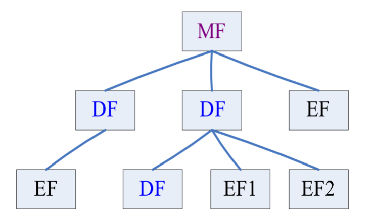

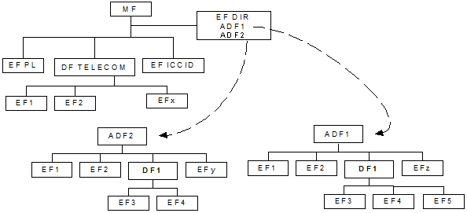

本文档并未对应用的位置施加任何限制。所有应用都由EFDIR中取得的应用标识符唯一地进行标识。这些应用标识符被用来选择应用。

EFDIR, EFPL和EFICCID都是必需的，直接放置在主目录（Master File）下。

DFTELECOM是可选的。当它存在时，存放在主目录中并使用保留的FID '7F 10'。DFTELECOM包括了应用的独立信息。

## 文件格式

卡中所有的文件都是由**文件头**和**文件体**组成的。

在TimeCOS/PK中文件头长度是12个字节，TimeCOS/PK用这些信息来管理文件

| 12字节文件头（文件类型、文件标识符、文件大小、权限、校验等） |
| :----------------------------------------------------------: |
|                           文件主体                           |

文件格式是在建立文件时唯一确定的，所使用的命令是Create File。

文件头定义：

|     文件头      | 长度（字节） |
| :-------------: | :----------: |
|    文件类型     |      1       |
| 文件标识（FID） |      2       |
|    文件大小     |      2       |
|    访问权限1    |      1       |
|    访问权限2    |      1       |
|       RFU       |      1       |
|       RFU       |      1       |
|     校验和      |      1       |
|       RFU       |      1       |
|       RFU       |      1       |

文件类型定义：

| 文件类型（HEX） | 文件描述                                  | 文件结构     |
| :-------------- | :---------------------------------------- | :----------- |
| 38              | MF或DF                                    |              |
| 28              | 二进制文件                                | 透明文件     |
| 2A              | 定长记录文件                              | 定长记录文件 |
| 2E              | 循环文件                                  | 循环文件     |
| 2F              | 钱包文件                                  | 循环文件     |
| 2C              | 变长记录文件                              | 变长记录文件 |
| 3D              | 私钥文件                                  | 透明文件     |
| 3E              | 公钥文件                                  | 透明文件     |
| 3F              | 秘钥文件（存放秘钥和PIN，不允许外部访问） | 变长记录文件 |

## 文件类型

### 主文件-MF（Master File）

每张卡片文件系统中只存在一个根文件，其他所有文件都是该文件的子文件。

MF是整个卡片的入口。

MF的标识符定义为**3F00**

文件头定义：

| 文件头          | 长度（字节） | 描述                              |
| --------------- | ------------ | --------------------------------- |
| 文件类型        | 1            | ‘38’                              |
| 文件标识（FID） | 2            | '3F00'                            |
| 文件大小        | 2            | 'FFFF' 指自动将MF空间建立为最大值 |
| 访问权限1       | 1            | 建立权限：在MF下建立文件的权限    |
| 访问权限2       | 1            | 擦除权限：擦除MF下所有文件的权限  |
| 保留            | 1            | 'FF'                              |
| 保留            | 1            | 'FF'                              |

### 专用文件-DF（Dedicated File）

在文件树中，除了MF之外，所有包含子文件的文件都称为DF。

任何一个DF在物理上和逻辑上都保持独立，都有自己的安全机制和应用数据。

为了标识不同的DF，每个DF具有一个同级DF下唯一的文件标识符（FID）和一个卡内全局唯一的应用标识符（AID）。

专用目录文件（DF）允许文件进行功能性分组。它可以是专用目录文件（ADF）和/或基本文件的上一级目录。专用目录文件是通过文件标识符被引用的。

应用专用目录文件(ADF)是特殊的专用目录文件，包括应用所有专用目录文件和基本文件。

文件头定义：

| 文件头          | 长度（字节） | 描述                             |
| --------------- | ------------ | -------------------------------- |
| 文件类型        | 1            | ‘38’                             |
| 文件标识（FID） | 2            |                                  |
| 文件大小        | 2            | 表示DF文件体大小                 |
| 访问权限1       | 1            | 建立权限：在DF下建立文件的权限   |
| 访问权限2       | 1            | 擦除权限：擦除DF下所有文件的权限 |
| 保留            | 1            | 'FF'                             |
| 保留            | 1            | 'FF'                             |

DF的分类：根据DF以下是否包含子DF，可以将DF分为：DDF和ADF。

1、DDF（目录专用文件）

如果在一个DF下还包含子DF的话，这样的DF被称为DDF（Directory Definition File）。

为了维护管理DDF下所有的DF，在每一个DDF下一般可以包含一个系统文件，即DIR文件，记录所有子DF的入口。

2、ADF（应用专用文件）

如果一个DF下不包含有其他的子DF的话，这样的DF称为ADF（Application Definition File）。

一般的，ADF是一个应用在卡内的逻辑映射，ADF下包含的都是存数据的文件。

ADF下没有DF文件，所以也就不需要DIR文件。

### 基本数据文件-EF（Elementary File）

在文件树中，如果一个文件节点没有子节点，这样的文件称为EF。

EF是卡内数据的基本载体。

在卡内，EF都隶属于某一个DF，通过文件标识符FID来标识EF。

#### 透明二进制文件

透明二进制文件是卡片内所有文件的基础，卡片将数据作为一个字节流来进行处理。

由一系列字符串组成的，具有二进制结构的EF文件。通过相对地址（偏移量），对特定的字节序列进行读写操作，地址由以字节为单位的起始地址及需要读写的字节个数组成。二进制EF的第一字节的相对地址为‘00 00’。EF文件的数据长度在EF的SELECT响应中指明。

文件头定义：

| 文件头          | 长度（字节） | 描述                   |
| --------------- | ------------ | ---------------------- |
| 文件类型        | 1            | ‘28’（非安全报文模式） |
| 文件标识（FID） | 2            |                        |
| 文件大小        | 2            | 文件体长度             |
| 访问权限1       | 1            | 读权限                 |
| 访问权限2       | 1            | 写权限                 |
| 维护秘钥标识    | 1            | 计算安全报文的秘钥标识 |
| 保留            | 1            | 'FF'                   |

文件体结构，长度（单位Byte）

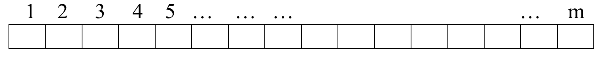

例如：从一个10字节的文件中读取偏移量为3的5个字节

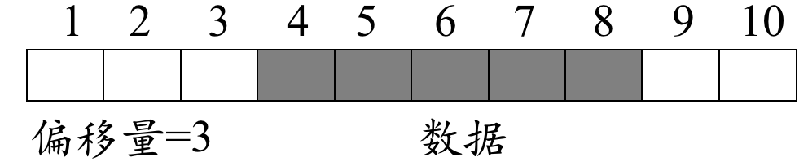

文件操作命令：

- 读二进制文件（Read Binary）：当满足文件的读权限时，可以用该命令读取文件信息。
- 写二进制文件（Update Binary）：当满足文件的写权限时，可以用该命令写入文件信息。

#### 定长记录文件

在定长记录文件中，文件体划分为n个等长的区段，每一个区段对应一条数据记录。

不同的记录通过记录号来区分访问。记录只能整条访问，不允许访问记录的部分数据。

具有线性定长结构的EF是由一些长度固定且相等的一系列记录组成。第一条记录的记录号是1。记录的长度和其与记录数的乘积在EF的SELECT响应中指明。

|          |
| :------: |
| Record 1 |
| Record 2 |
|    :     |
|    :     |
| Record n |

访问此类型EF中的记录的方法有若干种：

- 记录号的绝对引用
- 当记录指针未被设定时，可以使用NEXT或PREVIOUS模式作用于第一或最后一条记录
- 当记录指针被设定时，可以对本记录、下一条记录（本记录指针置于最后一条记录处除外）或前一条记录（本记录指针置于第一条记录处除外）进行处理
- 使用模式查询识别某一条记录

> 如果选定一条记录后的操作中途失败（如：由于执行某命令不成功），该记录指针应保持在操作执行前设定的位置。

目前，本类文件中包含最多254条记录，并且，每条记录不能超过255个字节

文件头定义：

| 文件头          | 长度（字节） | 描述                                                      |
| --------------- | ------------ | --------------------------------------------------------- |
| 文件类型        | 1            | ‘2A’（非安全报文模式）                                    |
| 文件标识（FID） | 2            |                                                           |
| 文件大小        | 2            | 字节1表示记录总个数（2-254） 字节2表示记录长度（≤178） |
| 访问权限1       | 1            | 读权限                                                    |
| 访问权限2       | 1            | 写权限                                                    |
| 维护秘钥标识    | 1            | 计算安全报文的秘钥标识                                    |
| 保留            | 1            | 'FF'                                                      |

文件体结构：

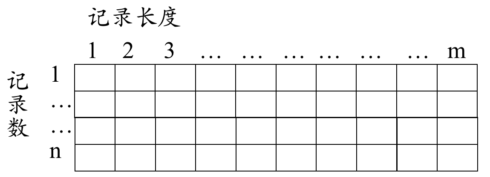

文件操作命令：

- 读记录文件（Read Record）：当满足文件的读权限时，可以用该命令读取一条记录。
- 写记录文件（Update Record）：当满足文件的写权限时，可以用该命令写（或更新）一条记录。

#### 变长记录文件

数据以记录为单位进行存储，但是每个记录段的长度都不相同。

通过记录号或记录标识符来选择每条记录。

一个文件中的记录数为2-254，不同的操作系统所支持的记录长度最大值不一样，TimeCOS/PK支持的记录长度最大值为178字节。

通常变长记录以TLV（Tag-Length-Value）格式存在。

> T（Tag）字段为单字节，其值从1到254，例如用作记录标识符。
>
> L（Length）字段由1个字节或者3个字节组成。
>
> - 如L字段的第1个字节的内容从00到F3，则表示L字段由1个字节组成
> - 如为FF，则标识第2、3两个字节标识L的值，即L字段由3个字节组成
>
> V（Value）字段为实际数据

文件头定义：

| 文件头          | 长度（字节） | 描述                   |
| --------------- | ------------ | ---------------------- |
| 文件类型        | 1            | ‘2C’（非安全报文模式） |
| 文件标识（FID） | 2            |                        |
| 文件大小        | 2            | 文件主体空间           |
| 访问权限1       | 1            | 读权限                 |
| 访问权限2       | 1            | 写/追加权限            |
| 维护秘钥标识    | 1            | 计算安全报文的秘钥标识 |
| 保留            | 1            | 'FF'                   |

文件体结构：

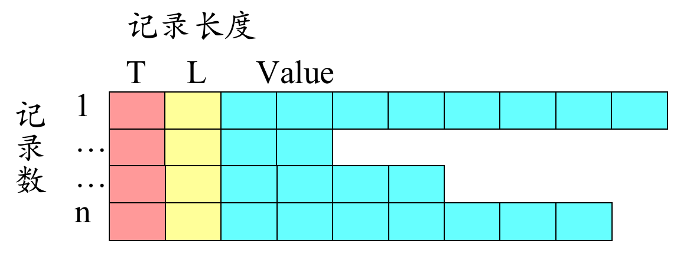

文件操作命令：

- 读记录文件（Read Record）：当满足文件的读权限时，可以用该命令读取一条记录。
- 写记录文件（Update Record）：当满足文件的写权限时，可以用该命令写（或更新）一条记录。
- 增加记录文件（Append Record）：当满足文件的添加权限时，可以用该命令追加一条新纪录。

#### 循环定长记录文件

数据以记录为单位进行存储。

循环记录文件用来存储按时间序列排列的记录。当所有的记录都已经被用于存储时，下一次数据的存储将覆盖最早的信息。

循环结构的EF由长度固定且相等的规定数量的记录组成。在本记录结构中，最后一条记录（n）链接至第一条记录。当记录指针被设置到最后一条记录n时，下一条记录为记录1。与之相类似，当记录指针被设置到第一条记录时，前一条记录为记录n。包含最新数据的最后更新的记录的记录号为1，包含最老数据的记录号为n。

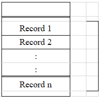

对于更新操作，仅有PREVIOUS记录可以被使用。对于读取操作，寻址的方法可以是Next、Previous、Current和Record Number。

> 如果选定一条记录后的操作中途失败（如：由于执行某命令不成功），则该记录指针应保持在操作执行前设定的位置。

目前，本类文件中包含最多254条记录，并且，每条记录不能超过254个字节。

文件头定义：

| 文件头          | 长度（字节） | 描述                                                       |
| --------------- | ------------ | ---------------------------------------------------------- |
| 文件类型        | 1            | ‘2E’（非安全报文模式）                                     |
| 文件标识（FID） | 2            |                                                            |
| 文件大小        | 2            | 字节1表示记录总个数（2-254） 字节2表示记录长度（≤178） |
| 访问权限1       | 1            | 读权限                                                     |
| 访问权限2       | 1            | 写/追加权限                                                |
| 维护秘钥标识    | 1            | 计算安全报文的秘钥标识                                     |
| 保留            | 1            | 'FF'                                                       |

文件体结构：

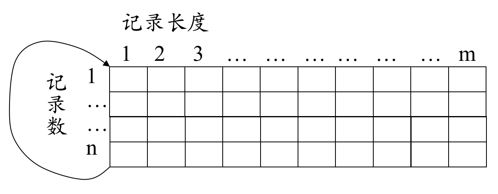

文件操作命令：

- 读记录文件（Read Record）：当满足文件的读权限时，可以用该命令读取一条记录。
- 写记录文件（Update Record）：当满足文件的写权限时，可以用该命令写（或更新）一条记录。
- 增加记录文件（Append Record）：当满足文件的添加权限时，可以用该命令追加一条新纪录。

### 基本数据文件-EF（按文件用途分类）

#### DIR文件

DIR文件是DDF下用以记录其子DF的文件。

通常为一个**记录文件**，记录的每一项分别对应着一个子DF。

DIR文件在DDF下唯一存在，必须在创建子DF之前创建出来。

DIR文件可以作为记录文件进行读取，但是通常不允许外接的写文件操作。DIR文件的维护工作由COS系统自动完成。

DIR文件记录格式举例：

| DIR文件 | 长度（字节） | 描述                                               |
| ------- | ------------ | -------------------------------------------------- |
| L       | 1            | 表示AID的长度                                      |
| AID     | Length       | DF的应用标识符                                     |
| DFADD   | 2            | DF文件的起始地址（相对于MF文件的起始地址开始计算） |

#### 秘钥文件

密钥文件是存放密钥的文件，在任何情况下均不可由外界读出。

每个DF下只能有一个KEY文件，且必须最先建立。

一个KEY文件可以包含多种密钥，每种密钥可以有多个。

KEY文件通常是一变长记录文件，每一条记录对应一条密钥。

密钥=密钥头（5字节）+密钥值

秘钥头——秘钥类型

| 密钥名称     | 类型字节              | 密钥名称         | 类型字节 |
| ------------ | --------------------- | ---------------- | -------- |
| DES加密密钥  | 30                    | 外部认证密钥     | 39       |
| DES解密密钥  | 31                    | 修改透支限额密钥 | 3C       |
| DESMAC密钥   | 32                    | 圈提密钥         | 3D       |
| 内部密钥     | 34                    | 消费密钥         | 3E       |
| 维护密钥     | 36                    | 圈存密钥         | 3F       |
| 主控密钥     | 密钥标识为 00的39密钥 | 口令（PIN）      | 3A       |
| 口令解锁密钥 | 37                    | 解锁口令         | 3B       |
| 口令重装密钥 | 38                    |                  |          |

文件头定义

| 文件头          | 长度（Byte） | 描述                               |
| --------------- | ------------ | ---------------------------------- |
| 文件类型        | 1            | ‘3F’                               |
| 文件标识（FID） | 2            | ’00 00’                            |
| 文件大小        | 2            | 所有密钥记录长度之和+5字节保留空间 |
| DF短文件标识符  | 1            | 见下表                             |
| 访问权限2       | 1            | 增加密钥权限                       |
| 保留            | 1            | ‘FF’                               |
| 保留            | 1            | ‘FF’                               |

DF短文件标识符

| b7   | b6   | b5   | b4   | b3   | b2   | b1   | b0   | 描述                                        |
| ---- | ---- | ---- | ---- | ---- | ---- | ---- | ---- | ------------------------------------------- |
| 0    | 0    | 0    | X    | X    | X    | X    | X    | 当前DF为DDF，低5位为DDF下DIR文件的SFI       |
| 1    | 0    | 0    | X    | X    | X    | X    | X    | 当前DF为ADF，低5位为发卡方专用数据文件的SFI |
| 1    | 1    | 1    | 1    | 1    | 1    | 1    | 1    | 保留值                  |

文件操作命令：

1、增加或修改秘钥命令（Write Key）

在满足秘钥文件的增加权限时，可以用该命令向秘钥文件中写入一条秘钥；在满足秘钥的更改权限时，可以用该命令更改秘钥数据（不能更改秘钥头数据）

2、对应不同类型的秘钥，有其相应的命令，在满足秘钥使用权限时才可使用相应的秘钥进行认证或密码运算。

####  公钥文件

用于存放RSA公钥。当满足文件使用权限时可进行验证、加密运算；当满足文件写权限时可以写入（更新）公钥。

公钥文件通常是一个二进制文件，每个公钥文件只能存放一个公钥。

文件头定义：

| 文件头          | 长度（Byte） | 描述                   |
| --------------- | ------------ | ---------------------- |
| 文件类型        | 1            | ‘3E’（非安全报文模式） |
| 文件标识（FID） | 2            |                        |
| 文件大小        | 2            | 公钥长度≥135           |
| 访问权限1       | 1            | 使用权限               |
| 访问权限2       | 1            | 更改权限               |
| 访问权限3       | 1            | 读权限                 |
| 维护密钥标识    | 1            | 计算安全报文的密钥标识 |

文件体结构：

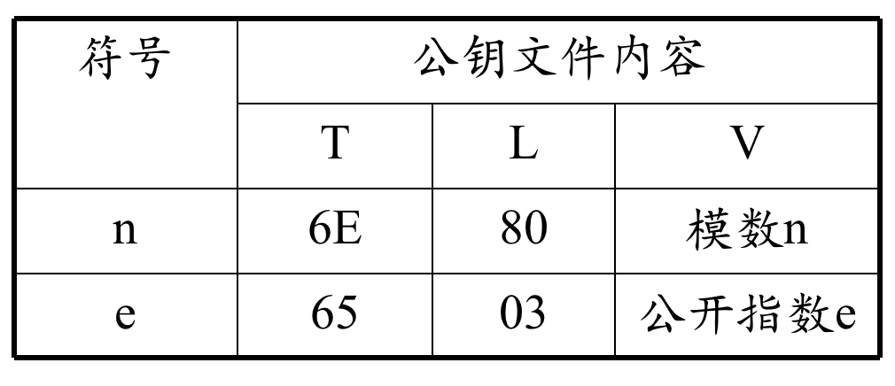

文件操作命令：

- 生成RSA秘钥对命令（Generate RSA Key）：可以用该命令生成模长为1024位的RSA秘钥对，公钥被直接送出卡外。
- 写二进制文件命令（Update Binary）：当满足公钥文件的更改权限时，可以用该命令把公钥写入公钥文件。
- 读二进制文件命令（Read Binary）：当满足公钥文件的读写权限时，可以用该命令独处公钥。
- 签名认证命令（Signatures Verify）：当满足公钥文件的使用权限时，可以用该命令进行签名认证。
- 数据加密（Data Encrypt）：当满足公钥文件的使用权限时，可以用该命令进行数据加密。

#### 私钥文件

用于存放RSA私钥。

当满足文件使用权限时可以进行数字签名、解密运算；当满足文件写权限时可以写入（更新）私有密钥。

私钥文件通常是一个二进制文件，每个私钥文件中只能存放一条私钥。

文件头定义：

| 文件头          | 字节（Byte） | 描述                   |
| --------------- | ------------ | ---------------------- |
| 文件类型        | 1            | ‘3D’（非安全报文模式） |
| 文件标识（FID） | 2            |                        |
| 文件大小        | 2            | 私钥长度≥330           |
| 访问权限1       | 1            | 使用权限               |
| 访问权限2       | 1            | 更改权限               |
| 访问权限3       | 1            | 读权限                 |
| 维护密钥标识    | 1            | 计算安全报文的密钥标识 |

文件体结构：

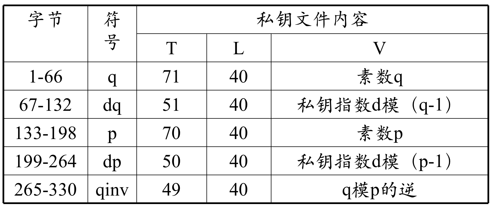

文件操作命令：

- 生成RSA秘钥命令（Generate RSA Key）：可以用该命令生成模长为1024位的RSA密钥对并把私钥写入私钥文件中(或直接送出卡外)。
- 写二进制文件命令（Update Binary）：当满足私钥文件的更改权限时，可以用该命令把私钥写入私钥文件。
- 读二进制文件命令（Read Binary）：当满足私钥文件的读权限时，可以用该命令读出私钥。
- 数字签名命令（Digital Signatures）：当满足私钥文件的使用权限时，可以用该命令进行数字签名。
- 数据解密（Data Decrypt）：当满足私钥文件的使用权限时，可以用该命令进行数据解密。

#### 应用自定义解释文件

这些特殊文件的数据含义由应用自定义和自解锁。

COS只是将其作为透明二进制、定长记录、变长记录、循环定长记录等文件类型来操作。

例如：普通钱包文件。

普通钱包文件的头文件定义：

| 文件头          | 字节（Byte） | 描述                                                  |
| --------------- | ------------ | ----------------------------------------------------- |
| 文件类型        | 1            | ‘2F’（非安全报文模式）                                |
| 文件标识（FID） | 2            |                                                       |
| 文件大小        | 2            | 字节1表示记录总个数（2-254） 字节2表示记录长度（＜8） |
| 访问权限1       | 1            | 扣款权限/读权限                                       |
| 访问权限2       | 1            | 存款权限                                              |
| 维护密钥标识    | 1            | 计算安全报文的密钥标识                                |
| 保留            | 1            | ‘FF’                                                  |

普通钱包文件相关操作指令

- 存款命令（Increase）：在满足存款权限时，可以用该命令增加钱包余额。
- 扣款命令（Decrease）：在满足扣款权限时，可以用该命令减少钱包余额。
- 读记录文件（Read Record）：在满足读权限时，可以用该命令读出指定记录。

## 文件引用

### 文件标识符FID

文件标识符（FID）用于定位或标识一个特定的文件。FID由2个字节组成，应以十六进制表示。

在选择文件时只要指出文件标识就可以找到相应文件。

FID应遵从于以下条件：

- 在有关文件建立时，应设定其FID
- 同一上级目录之下的两个文件的ID不相同
- 当前目录的子文件及当前目录的父文件及直接子目录不能具有相同的FID值
- MF的FID为‘3F 00’，KEY文件FID为‘00 00’，‘FF FF’保留

FID的串连接就是路径。路径以MF或当前DF开始，以文件本身的标识符为结束。如果当前DF的标识符未知，在路径开始处应使用保留值‘3FFF’。FID的顺序总是从上级目录到子目录。

MF的文件标识符为3F 00。

### 短文件标识符SFI

短文件标识符由5个二进制位组成（bit4~bit0），可选择的最大文件标识符为31。

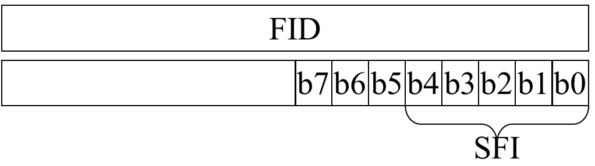

短文件标识符（SFI）占5个比特，范围是1到31。同一上级目录下的任意两个文件的SFI不相同。

若文件需要用段文件标识符进行选择，则建立文件时就需将文件标识符取在1~31（00001-11111）之间。

### DF名称

DF名称占1至16个字节。DF的名称是AID，在同一张卡上，应是唯一的。

## 文件访问方式

在UICC激活并且返回复位应答（ATR）后，根目录被默认为当前目录。利用“SELECT”功能，通过本章中定义的3个文件引用方法中的一种可选择每一个文件。

### 文件标识符FID

选择一个DF、ADF和MF设置为当前目录，在这次选择之后，不存在当前EF。选择EF设置当前EF，当前目录仍为DF、ADF或MF，这是EF的上级目录。当前EF总是当前目录的一个子文件。只有当前应用的ADF可以通过FID选择。

任何应用的专用命令都应仅在该应用是当前目录时才可操作。

下列文件可以从最后选中的文件通过文件ID标识符（FID）引用被选中。

- 任何当前目录的直接子文件
- 任何当前DF的父目录的直接子目录
- 当前DF或ADF
- MF

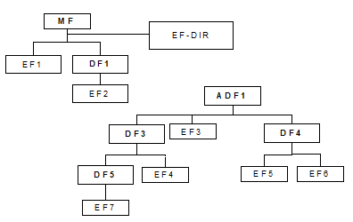

下表给出了使用FID引用时，遵循上图所示逻辑结构的本文档定义的应用有效选择方式。最后选定的文件重新选择也是允许的，但并不显示。

| 最后选定的文件 | 有效选择                |
| -------------- | ----------------------- |
| MF             | DF1, EF1, EF-DIR        |
| DF1            | MF, EF2                 |
| ADF1           | MF, DF3, DF4, EF3       |
| DF3            | MF, ADF1, DF4, DF5, EF4 |
| DF4            | MF, ADF1, DF3, EF5, EF6 |
| DF5            | MF, DF3, EF7            |
| EF1            | MF, DF1, DF-DIR         |
| EF2            | MF, DF1                 |
| DF3            | MF, ADF1, DF3, DF4      |
| EF4            | MF, ADF1, DF3, DF5      |
| EF5            | MF, DF4, ADF1,EF6       |
| EF6            | MF, DF4, ADF1, EF5      |
| EF7            | MF, DF3, DF5            |

以SELECT FILE指令为例，格式为：

| 代码 | 长度（byte） | 值（HEX） |                  描述                   |
| :--: | :----------: | :-------: | :-------------------------------------: |
| CLA  |      1       |    00     |                    -                    |
| INS  |      1       |    A4     |                    -                    |
|  P1  |      1       |    00     |           通过文件标识符选择            |
|  P2  |      1       |    00     |                    -                    |
|  Lc  |      1       |    02     |                    -                    |
| DATA |      2       |  **FID**  |               文件标识符                |
|  Le  |      1       |    XX     | 对于DF而言为卡片自动返回的FCI的最大长度 |

### 路径

一个文件，DF或EF，可以通过路径引用进行选择。下表是上图通过路径选择的实例。本例中还考虑了当前应用（ADF1）此前已经通过DF名被选中的情况。下表中的ADF1的FID为'7FFF'。

| 最后选中的DF | 路径的开始| 选择实例  |
| ------------ | -------------------- | ------------------------------------------------------------ |
| 任意         | MF                   | EF1  EF-DIR  DF1  DF1\|\|EF2           |
| 任意         | MF                   | 7FFF\|\|DF3  7FFF\|\|DF3\|\|EF4 7FFF\|\|DF3\|\|DF5 7FFF\|\|DF3\|\|DF5\|\|EF7 7FFF\|\|DF4  7FFF \|\|DF4\|\|EF5 7FFF\|\|DF4\|\|EF6 7FFF\|\|EF3 |
| DF1          | Current DF           | EF2                                                        |
| DF3          | Current DF           | DF5 DF5\|\|EF7 EF4                         |
| DF4          | Current DF           | EF5  EF6                                            |
| DF5          | Current DF           | EF7                                                        |

- 在“从MF通过路径选择”中，终端不应在路径起始位置使用MF的文件标识（如：‘3F00’）。

- 在“从MF通过路径选择”中，终端可以在路径开始处使用特定的FID '7FFF'（见8.5节）。既在该逻辑通道中，路径开始于当前被激活应用的ADF。
- 在“从当前DF通过路径选择”中，终端不应在路径开始处使用特定文件ID '7FFF'。
- 在“从MF通过路径选择”或“从当前DF通过路径选择”中，终端不应使用当前DF（如：‘3FFF’）的标识。
- 在“从MF通过路径选择”或“从当前DF通过路径选择”中，终端不应使用空数据字段。

### 短文件标识符SFI

DF中的任何EF可在DF或ADF级别通过以下命令并将短文件标识符（SFI）作为命令的一部分默认地实现对文件的选择，而无需使用SELECT命令。

- Read Binary
- Update Binary
- Read Record
- Update Record
- Increase
- Search

当文件的FCP包括带标识‘88’的TLV DO，SFI对特定文件的支持。如果长度字节的值为0，表示该文件不支持短文件标识符。如果文件的FCP中没有TLV DO字段，则表示该文件的FID的低5位数据为文件的SFI。

当READ RECORD命令包含一个有效的SFI时，本文件被设为当前EF，且复位当前指针。后续的记录通过READ RECORD命令读入，且无需SFI。

当UPDATE RECORD命令包括一个有效的SFI时，本文件被设为当前EF，且复位当前指针。后续的记录通过update RECORD命令更新，无需SFI。

当INCREASE命令包括一个有效的SFI时，本文件被设为当前EF，且复位当前指针。后续的记录通过INCREASE命令增加，无需SFI。

当SEARCH RECORD命令包括一个有效的SFI时，本文件被设为当前EF，且复位当前指针。后续的记录通过SEARCH RECORD命令搜索，无需SFI。

在Read Binary、Update Binary指令中，通过对参数P1的设置来实现对文件的访问。

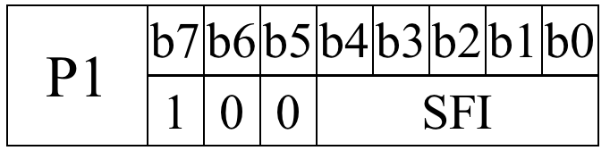

P1=81H，即100<u>00001</u>，所选文件的SFI为00001

在Read Record、Update Record、Append Record、Decrease、Increase指令中，通过对参数P2的设置来实现对文件的访问。

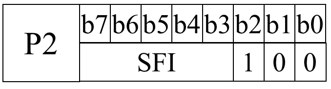

P2=0CH，即<u>00001</u>100，所选文件SFI为00001.

### DF文件名

DF文件名对应其应用标识AID（Application Identifier），其长度为5-16字节。

| 应用标识符（AID） | 长度（字节） |
| ----------------- | ------------ |
| RID               | 5            |
| PIX               | 1~11         |

- RID（Registered ID）注册ID：由注册机构分配，包含国家代码、应用类别和应用提供商的标识符
- PIX（Proprietary Application Identifier Extension）专用应用标识符拓展码：可选，由应用提供商定义

## 文件访问条件

每个文件都有特殊的访问条件，最近选择的文件的访问条件在请求操作前就得满足。

READ和SEEK的访问条件相同。

SELECT和STATUS命令可以无条件访问文件。

MF和DF的访问条件待定。

| Level   | Access Condition            | 描述                                                         |
| ------- | --------------------------- | ------------------------------------------------------------ |
| 0       | Always                      | 无条件执行                                                   |
| 1       | CHV1                        | 卡持有者认证1：满足下列3个条件的其中一个即可 ①CHV1值正确 ②CHV1不使能 ③在当前对话期间已经成功执行力UNBLOCK CHV1解锁 |
| 2       | CHV2                        | 卡持有者认证2：满足下列2个条件的其中一个即可 ①CHV2值正确 ②在当前对话期间已经成功执行力UNBLOCK CHV2解锁 |
| 3       | Reserved for GSM Future Use |                                                              |
| 4 to 14 | ADM                         | 级别的划分及其要完成的要求是主管部门的权限                   |
| 15      | Never                       | 在SIM/ME接口不能实现的，SIM卡可执行内部的动作                |

## 文件操作命令

| COMMAND           | 值（INS） | 描述                                                         |
| ----------------- | --------- | ------------------------------------------------------------ |
| Select            | A4        | 选择文件                                                     |
| Status            | F2        | 查询当前目录的信息                                           |
| Read binary       | B0        | 读取透明二进制文件                                           |
| Update binary     | D6        | 更新透明二进制文件                                           |
| READ RECORD       | B2        | 读取线性固定文件/循环文件的记录                              |
| UPDATE RECORD     | DC        | 更新线性固定文件/循环文件的记录                              |
| SEEK/SEARCH       | A2        | 查找线性固定文件中与关键字匹配的记录                         |
| INCREASE          | 32        | 向循环文件中插入最旧的记录                                   |
| VERIFY CHV        | 20        | 验证PIN码                                                    |
| CHANGE CHV        | 24        | 修改PIN码                                                    |
| DISABLE CHV       | 26        | 关闭PIN验证码                                                |
| ENABLE CHV        | 28        | 打开PIN验证码                                                |
| UNBLOCK CHV       | 2C        | 解锁                                                         |
| INVALIDATE        | 04        | 使当前EF文件无效                                             |
| REHABILITATE      | 44        | 使当前EF文件恢复有效状态                                     |
| RUN GSM ALGORITHM | 88        | 启动SIM卡中的GSM算法A3和A8                                   |
| SLEEP             | FA        | 睡眠命令只被PHASE1的移动设备支持，对于PHASE2或者以后的移动设备不会使用该命令 |
| GET RESPONSE      | C0        | 返回上一条指令的响应数据                                     |
| TERMINAL PROFILE  | 10        | 告知SIM卡手机对STK的支持能力，初始化SIM卡的过程中发送给SIM卡 |
| ENVELOPE          | C2        | 手机发送数据或者事件给SIM卡                                  |
| FETCH             | 12        | 手机从SIM卡获取命令                                          |
| TERMINAL RESPONSE | 14        | 手机返回SIM卡执行主动式命令的结果                            |

文件操作应答内容

| SW1 SW2 | 描述                                          |
| ------- | --------------------------------------------- |
| 9000    | 命令正常完成                                  |
| 61XX    | SW2表示仍然有效的响应字节数                   |
| 6E00    | CLA不支持                                     |
| 6D00    | CLA支持，但INS未编程或无效                    |
| 6B00    | CLA INS支持，但P1、P2不正确                   |
| 6700    | CLA INS P1 P2支持，但P3不正确                 |
| 6F00    | 命令不支持且未给出精确诊断                    |
| 6982    | 不满足安全条件：SIM PUK时，想要读IMSI就会出现 |
| 6E00    | SIM卡却用USIM卡的指令                         |
| 6A82    | 没有找到文件                                  |
| 6A86    | P1-P2参数不对                                 |

CLA的值：

| COMMAND           | UICC CLA | SIM CLA | INS  |
| ----------------- | -------- | ------- | ---- |
| SELECT            | 00       | A0      | A4   |
| STATUS            | 80       | A0      | F2   |
| READ BINARY       | 00       | A0      | B0   |
| UPDATE BINARY     | 00       | A0      | D6   |
| READ RECORD       | 00       | A0      | B2   |
| UPDATE RECORD     | 00       | A0      | DC   |
| SEARCH RECORD     | 00       | A0      | A2   |
| INCREASE          | 80       | A0      | 32   |
| VERIFY PIN        | 00       | A0      | 20   |
| CHANGE PIN        | 00       | A0      | 24   |
| DISABLE PIN       | 00       | A0      | 26   |
| ENABLE PIN        | 00       | A0      | 28   |
| UNBLOCK PIN       | 00       | A0      | 2C   |
| DEACTIVATE FILE   | 00       | A0      | 04   |
| ACTIVATE FILE     | 00       | A0      | 44   |
| AUTHENTICATE      | 00       | A0      | 88   |
| GET CHALLENGE     | 00       | A0      | 84   |
| TERMINAL PROFILE  | 80       | A0      | 10   |
| ENVELOPE          | 80       | A0      | C2   |
| FETCH             | 80       | A0      | 12   |
| TERMINAL RESPONSE | 80       | A0      | 14   |
| MANAGE CHANNEL    | 00       | A0      | 70   |
| GET RESPONSE      | 00       | A0      | C0   |

### Create File

#### 命令功能描述

该命令用于建立文件系统。

在满足当前DF的建立权限时，可用该命令在当前DF下创建新的文件（DF或EF）。

每个DF下只能有一个KEY文件，且必须最先被建立。

#### 命令报文格式

| 代码 | 长度（byte） | 值（Hex） | 描述          |
| ---- | ------------ | --------- | ------------- |
| CLA  | 1            | 80        |               |
| INS  | 1            | E0        |               |
| P1P2 | 2            | XX XX     | 文件标识符FID |
| Lc   | 1            | XX        |               |
| DATA | Lc           | XX…XX     | 文件控制信息  |
| Le   |              |           | 不存在        |

- MF的FID必须是‘3F 00’

- KEY文件的FID必须是‘00 00’

- 公钥/私钥文件的FID高字节必须是‘00’

建立MF文件时

- P1P2=‘3F 00’
- DATA域文件控制信息为

| DATA       | 文件类型 | 文件空间 | 建立权限 | 擦除权限 | 8字节传输代码 |
| ---------- | -------- | -------- | -------- | -------- | ------------- |
| 长度(byte) | 1        | 2        | 1        | 1        | 8             |
| 值(HEX)    | 38       | FFFF     | XX       | XX       | XX…XX         |

建立DF文件时

- DATA域文件控制信息为

| DATA       | 文件类型 | 文件空间 | 建立权限 | 擦除权限 | 保留字 | DF名称（可选） |
| ---------- | -------- | -------- | -------- | -------- | ------ | -------------- |
| 长度(byte) | 1        | 2        | 1        | 1        | 3      | 5-16           |
| 值(HEX)    | 38       | XXXX     | XX       | XX       | FFFFFF | DF名称         |

建立EF文件时

- Lc=‘07’
- DATA域文件控制信息为（不带线路保护时）

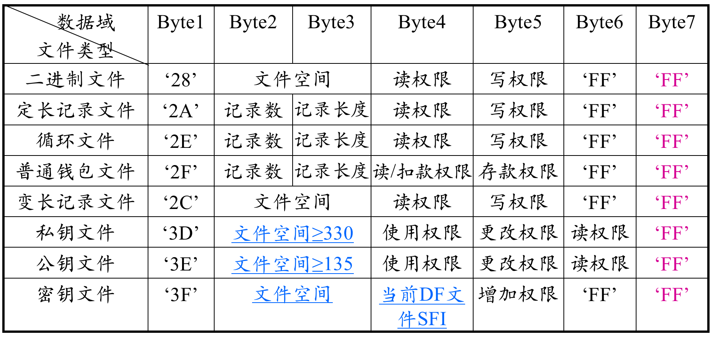

#### 响应报文数据

- 不存在

#### 响应报文状态码

| SW1  | SW2  | 意义                            |
| ---- | ---- | ------------------------------- |
| 90   | 00   | 命令成功执行                    |
| 67   | 00   | 错误的长度                      |
| 69   | 82   | 建立权限不满足                  |
| 6A   | 80   | 记录个数小于2或目录级数超过三级 |
| 6A   | 84   | 文件无足够空间                  |
| 6A   | 86   | 文件已存在                      |

#### 命令使用示例

- 预设环境

假设目前卡中已存在MF，要在MF下建立一个KEY文件，一个DIR文件，两个DF文件和一个定长记录EF文件，即：

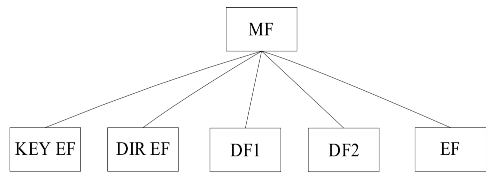

-  命令报文

1、增加KEY EF，设其文件大小为0x007D，增加权限为F0

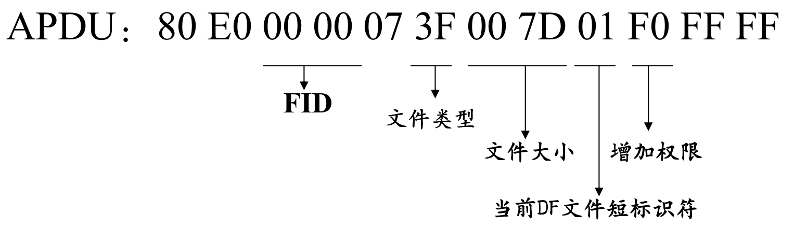

2、创建DIR EF，设其FID=00 01，文件大小为0x0030，读权限为F0，写权限为AA。

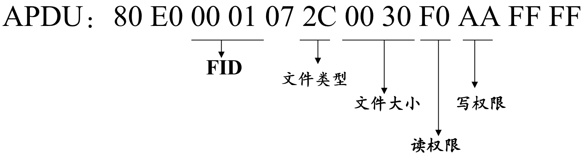

3、创建DF1，设其FID=3F 01，文件空间为0x1234，建立权限和擦除权限均为F0，DF名称为11 22 33 44 55 66 77 88。

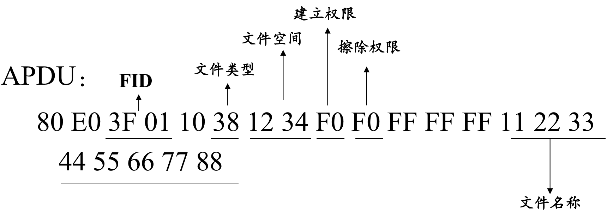

4、创建DF2，设其FID=3F 02，文件空间为0x5678，建立权限和擦除权限均为F0，DF名称为88 77 66 55 44 33 22 11。

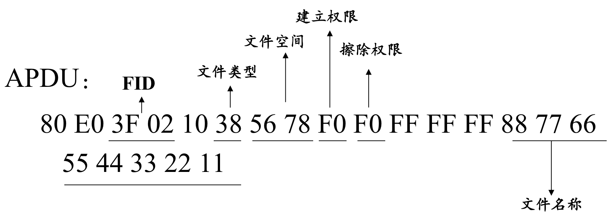

5、创建定长EF，设其FID=00 02，支持16条记录，每条记录18字节，读权限为F0，写权限为F0。

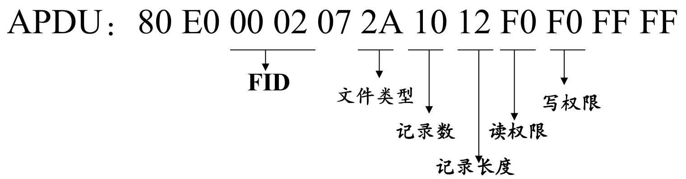

创建结果：

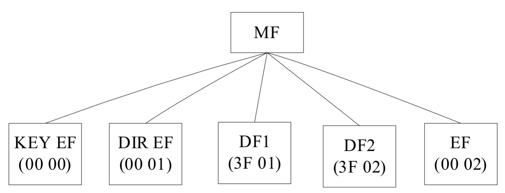

### 上一条补充：Erase MF（擦除主文件MF）

#### 命令功能描述

- 在满足MF的擦除权限时，可以用此命令擦除MF下的所有文件（DF、EF）。
- 但MF当前的访问权限、空间等信息并不改变（即不能擦除当前MF的文件头信息）。

#### 命令报文格式

| 代码 | 长度（byte） | 值（Hex） | 描述   |
| ---- | ------------ | --------- | ------ |
| CLA  | 1            | 80        | -      |
| INS  | 1            | 0E        | -      |
| P1   | 1            | 00        | -      |
| P2   | 1            | 00        | -      |
| Lc   | 1            | 00        | -      |
| DATA | -            | -         | 不存在 |
| Le   | -            | -         | 不存在 |

#### 响应报文数据

不存在

#### 响应报文状态码

| SW1  | SW2  | 意义           |
| ---- | ---- | -------------- |
| 90   | 00   | 命令成功执行   |
| 65   | 81   | 写EEPROM不成功 |
| 69   | 82   | 擦除权限不满足 |

#### 命令使用示例

APDU：80 0E 00 00 00

注：擦除MF后应马上建立KEY EF，否则卡将自锁。

### Select File（选择文件）

#### 命令功能描述

该命令通过文件名、文件标识符或选择下一个应用来选择IC卡中的MF、DF。

能够选择到父DF，同级DF和下级DF、EF以及MF。

#### 命令报文格式

| 代码 | 长度（byte） | 值（Hex） | 描述                                         |
| ---- | ------------ | --------- | -------------------------------------------- |
| CLA  | 1            | 00        | -                                            |
| INS  | 1            | A4        | -                                            |
| P1   | 1            | 00或04    | 00：通过文件标识符选择 04：通过DF名称选择 |
| P2   | 1            | 00        | -                                            |
| Lc   | 1            | XX        | -                                            |
| DATA | XX           | XX…XX     | 文件标识符或DF名称                           |
| Le   | 1            | XX        | 对于DF而言为卡片自动返回的FCI的最大长度      |

#### 响应报文数据

- 成功选择DDF后会送的文件控制信息FCI

| 标志 | 值                         | 存在方式 |
| ---- | -------------------------- | -------- |
| 6F   | 文件控制信息模板           | 必备     |
| 84   | DF名称                     | 必备     |
| A5   | 文件控制信息专用数据       | 可选     |
| 88   | 目录基本文件的短文件标识符 | 可选     |

- 成功选择ADF后回送的文件控制信息FCI

| 标志 | 值                           | 存在方式 |
| ---- | ---------------------------- | -------- |
| 6F   | 文件控制信息模板             | 可选     |
| 84   | DF名称                       | 可选     |
| A5   | 文件控制信息专用数据         | 必备     |
| 9F0C | 发卡方自定数据的文件控制信息 | 必备     |

#### 响应报文状态码

略

#### 命令使用示例

1、用两种方法选择MF，假设MF的文件名为11 22 33 44 55

- 命令报文1APDU：00 A4 00 00 02 3F 00
- 命令报文2APDU：00 A4 04 00 05 11 22 33 44 55

2、按文件标识符选择当前DF下的字DF或EF

| CLA  | INS  | P1   | P2   | Lc   | DATA       |
| ---- | ---- | ---- | ---- | ---- | ---------- |
| 00   | A4   | 00   | 00   | 02   | 文件标识符 |

成功选择文件后

- 若选择的文件为子DF，则该子DF成为当前DF
- 若选择的文件为EF，该文件成为当前文件

3、通过文件名选择DF

| CLA  | INS  | P1   | P2   | Lc   | DATA     |
| ---- | ---- | ---- | ---- | ---- | -------- |
| 00   | A4   | 00   | 00   | XX   | DF文件名 |

成功选择DF后，该DF成为当前DF

### Update Binary（写二进制文件）

#### 命令功能描述

- 用于更新二进制文件的全部或者部分内容
- 每次更新内容在256字节以内，如果需要更新超过256字节的内容的话，需要通过多次操作完成
- 适用于二进制文件、公钥文件和私钥文件
- 满足二进制文件的写权限时才能执行此命令

#### 命令报文格式（不带线路保护）

| 代码 | 长度（byte） | 值（Hex） | 描述           |
| ---- | ------------ | --------- | -------------- |
| CLA  | 1            | 00        | -              |
| INS  | 1            | D6        | -              |
| P1   | 1            | XX        |                |
| P2   | 1            | XX        |                |
| Lc   | 1            | XX        | -              |
| DATA | XX           | XX… XX    | 写入文件的数据 |
| Le   | -            | -         | 不存在         |

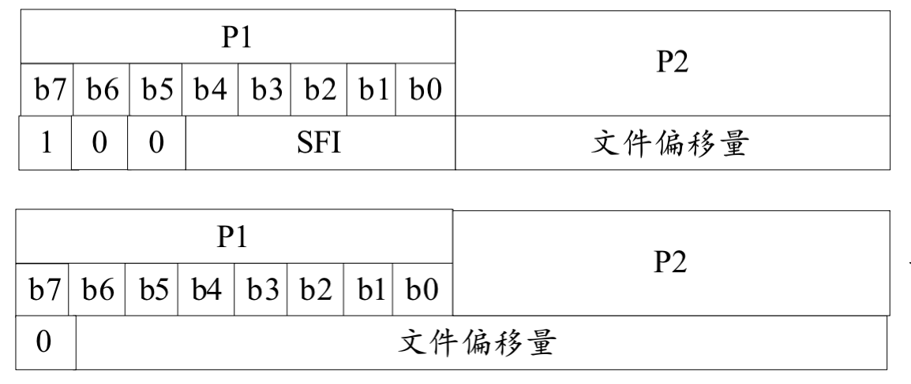

前提：缩写文件为当前文件。

#### 响应报文数据

不存在

#### 响应报文状态码

略

#### 命令使用示例

假设有二进制文件，FID=0x0005，总长度为0x0014

1、将该文件内容写为01 02 03 04 05 06 07 08 09 0A 0B 0C 0D 0E 0F 10 11 12 13 14

命令报文APDU：00 D6 85 00 14 01 02 03 04 05 06 07 08 09 0A 0B 0C 0D 0E 0F 10 11 12 13 14

2、将该文件的第10-17字节更新为11 22 33 44 55 66 77 88

命令报文APDU：00 D6 85 09 08 11 22 33 44 55 66 77 88

### Read Binary（读二进制文件）

#### 命令功能描述

- 用于读取二进制文件的全部或者部分内容
- 每次读取的内容在256字节以内，如果需要读取超过256字节的内容的话，需要通过多次操作完成
- 适用于二进制文件、公钥文件和私钥文件
- 满足二进制文件的读权限时才能执行此命令

#### 命令报文格式（不带线路保护）

| 代码 | 长度（byte） | 值（Hex） | 描述             |
| ---- | ------------ | --------- | ---------------- |
| CLA  | 1            | 00        | -                |
| INS  | 1            | B0        | -                |
| P1   | 1            | XX        |                  |
| P2   | 1            | XX        |                  |
| Lc   | -            | -         | 不存在           |
| DATA | -            | -         | 不存在           |
| Le   | 1            | XX        | 要读取的数据长度 |

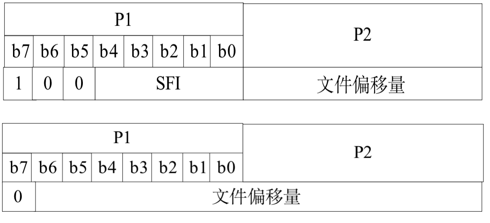

前提：所读文件为当前文件。

#### 响应报文数据

由读取的数据组成

#### 响应报文状态码

略

#### 命令使用示例

假设有二进制文件，FID为0x0005，总长度为0x0014，读取其内容。

命令报文APDU：00 B0 85 00 14

### Update Record（写记录文件）

#### 命令功能描述

- 用于添加记录或更改指定的记录
- 对线性结构文件来说，当指定的记录号不存在时，可按记录号顺序添加记录。按记录标识符访问的记录不存在时，也应视为添加新的记录
- 满足记录文件的写权限时才能执行此命令

#### 命令报文格式（不带线路保护）

| 代码 | 长度（byte） | 值（Hex） | 描述                         |
| ---- | ------------ | --------- | ---------------------------- |
| CLA  | 1            | 00        | -                            |
| INS  | 1            | DC        | -                            |
| P1   | 1            | XX        | 记录号或记录标识符           |
| P2   | 1            | XX        |                              |
| Lc   | 1            | XX        | 数据长度                     |
| DATA | XX           | XX…XX     | 添加的或更新原有记录的新记录 |
| Le   | -            | -         | 不存在                       |

参数P2的含义如下表所示：

| b7 b6 b5 b4 b3 b2 b1 b0     | 描述                           |
| --------------------------- | ------------------------------ |
| 0  0  0  0  0   -   -   -   | 对当前EF进行操作               |
| x  x  x  x  x   -   -   -   | 短文件标识符                   |
| -   -  -   -   -   1  0   0 | P1记录号                       |
| -   -  -   -   -   0  0   0 | P1指定记录标识符的第一个记录   |
| -   -  -   -   -   0  0   1 | P1指定记录标识符的最后一个记录 |
| -   -  -   -   -   0  1   0 | 前一个P1指定记录标识符的记录   |
| -   -  -   -   -   0  1   1 | 下一个P1指定记录标识符的记录   |

>1、XXXXX代表SFI；
>
>2、循环记录文件只能用P1=00，P2=03来添加；

#### 响应报文数据

不存在

#### 响应报文状态码

略

#### 命令使用示例

1、文件类型：定长记录文件；FID=0x0002；记录数=3条；记录长度=12个字节

- 操作：将定长记录文件的第一条记录写为01 02 03 04 05 06 07 08 09 0A 0B 0C
- 命令报文APDU：00 DC 01 14 0C 01 02 03 04 05 06 07 08 09 0A 0B 0C

2、文件类型：循环定长记录文件；FID=0x0003；记录数=3条；记录长度=12个字节

- 操作：在循环文件中追加1条记录。记录内容为01 02 03 04 05 06 07 08 09 0A 0B 0C
- 命令报文APDU：00 DC 00 03 0C 01 02 03 04 05 06 07 08 09 0A 0B 0C
- 响应报文：90 00

3、文件类型：变长记录文件；FID=0x0001;其中有条记录为AA 02 11 22

-  操作：修改记录标识为AA的记录，同时将记录标识改为CC
- 命令报文APDU：00 DC AA 08 04 CC 02 11 22
- 响应报文：90 00

### Read Record（读记录文件）

#### 命令功能描述

- 用于读记录文件的一条或多条记录
- 适用于定长记录文件、循环文件、钱包文件和变长记录文件
- 满足记录文件的读权限时才能执行此命令

#### 命令报文格式（不带线路保护）

| 代码 | 长度（byte） | 值（Hex） | 描述               |
| ---- | ------------ | --------- | ------------------ |
| CLA  | 1            | 00        | -                  |
| INS  | 1            | B2        | -                  |
| P1   | 1            | XX        | 记录号或记录标识符 |
| P2   | 1            | XX        |                    |
| Lc   | -            | -         | 不存在             |
| DATA | -            | -         | 不存在             |
| Le   | 1            | XX        | 要读取的数据长度   |

参数P2的含义如下表所示：

| b7 b6 b5 b4 b3 b2 b1 b0     | 描述                                     |
| --------------------------- | ---------------------------------------- |
| 0  0  0  0  0   -   -   -   | 对当前文件进行操作                       |
| x  x  x  x  x   -   -   -   | 基本文件标识符                           |
| -   -  -   -   -   1  0   0 | 按记录号，读P1指定的记录                 |
| -   -  -   -   -   1  0   1 | 按记录号，从P1指定的记录读到最后一条记录 |
| -   -  -   -   -   1  1   0 | 按记录号，读从开始到P1指定的记录         |
| -   -  -   -   -   0  0   0 | 读P1指定记录标识符的第一个记录           |
| -   -  -   -   -   0  0   1 | 读P1指定记录标识符的最后一个记录         |
| -   -  -   -   -   0  1   0 | 读下一个P1指定记录标识符的记录           |
| -   -  -   -   -   0  1   1 | 读前一个P1指定记录标识符的记录           |

> XXXXX代表SFI；

#### 响应报文数据

由读出的记录组成。

#### 响应报文状态码

略

#### 命令使用示例

1、文件类型：定长记录文件；FID=0x0002；记录数=3条；记录长度=12个字节

- 操作：读出定长记录文件中记录号为02的记录
- 命令报文APDU：00 B2 02 0C 0C
- 响应报文：0C 0B 0A 09 08 07 06 05 04 03 02 01 90 00

2、文件类型：循环定长记录文件；FID=0x0003；记录数=3条；记录长度=12个字节

- 操作：读出循环记录文件中记录号为01的记录，即最新写入的记录
- 命令报文APDU：00 B2 01 1C 0C
- 响应报文：0C 0B 0A 09 08 07 06 05 04 03 02 01 90 00

3、文件类型：变长记录文件；FID=0x0001

- 操作①：按记录标识来读，读出变长记录文件中记录标识为CC的记录
- 命令报文APDU①：00 B2 CC 08 04
- 响应报文①：CC 02 11 22 90 00（该记录共4字节，为TLV格式）
- 操作②：按记录号来读，读出变长记录文件中的第一条记录
- 命令报文APDU②：00 B2 01 0C 04
- 响应报文②：CC 02 11 22 90 00（该记录共4字节，为TLV格式）

4、文件类型：钱包文件；FID=0x0004；记录数=2条；记录长度=4个字节

- 操作：读出钱包文件中记录号为01的记录，即最新写入的记录
- 命令报文APDU：00 B2 01 24 04
- 响应报文：00 00 00 01 90 00（00 00 00 01为钱包的新余额）

### Append Record（增加记录）

#### 命令功能描述

- 用于对变长记录文件、循环定长记录文件追加记录
- 只有满足记录文件写/添加权限时才能执行此命令
- 若循环记录文件已满则覆盖最早写入的记录，且新增加记录的记录号总为1

#### 命令报文格式（不带线路保护）

| 代码 | 长度（byte） | 值（Hex） | 描述           |
| ---- | ------------ | --------- | -------------- |
| CLA  | 1            | 00        | -              |
| INS  | 1            | E2        | -              |
| P1   | 1            | 00        | -              |
| P2   | 1            | XX        |                |
| Lc   | 1            | XX        | 要写入的字节数 |
| DATA | XX           | XX…XX     | 写入的数据     |
| Le   | -            | -         | 不存在         |

参数P2的含义

| b7   | b6   | b5   | b4   | b3   | b2   | b1   | b0   | 含义                |
| ---- | ---- | ---- | ---- | ---- | ---- | ---- | ---- | ------------------- |
| X    | X    | X    | X    | X    | 0    | 0    | 0    | b3-b7为短文件标识符 |
| 0    | 0    | 0    | 0    | 0    | 0    | 0    | 0    | 当前文件            |

#### 响应报文数据

不存在

#### 响应报文状态码

略

#### 命令使用示例

文件类型：循环定长记录文件；FID=0x0003

- 操作：往循环定长记录文件中增加1条记录，内容为11 22 33 44 55 66 77 88 99 AA BB CC
- 命令报文APDU：00 E2 00 18 0E AA 0C 11 22 33 44 55 66 77 88 99 AA BB CC
- 响应报文：90 00

## 文件内容

### 必选文件列表

| 文件标识符  | 文件类型     |
| ----------- | ------------ |
| EFDIR       | 线性定长文件 |
| EFICCID     | 二进制文件   |
| EFPL        | 二进制文件   |
| EFLI        | 二进制文件   |
| EFIMSI      | 二进制文件   |
| EFKeys      | 二进制文件   |
| EFKeysPS    | 二进制文件   |
| EFPLMNwAcT  | 二进制文件   |
| EFHPLMN     | 二进制文件   |
| EFACMmax    | 二进制文件   |
| EFUST       | 二进制文件   |
| EFACM       | 循环文件     |
| EFGID1      | 二进制文件   |
| EFGID2      | 二进制文件   |
| EFSPN       | 二进制文件   |
| EFPUCT      | 二进制文件   |
| EFCBMI      | 二进制文件   |
| EFACC       | 二进制文件   |
| EFFPLMN     | 二进制文件   |
| EFLOCI      | 二进制文件   |
| EFAD        | 二进制文件   |
| EFCBMID     | 二进制文件   |
| EFECC       | 线性定长文件 |
| EFCBMIR     | 二进制文件   |
| EFPSLOCI    | 二进制文件   |
| EFFDN       | 线性定长文件 |
| EFSMS       | 线性定长文件 |
| EFSMSP      | 线性定长文件 |
| EFSMSS      | 二进制文件   |
| EFSMSR      | 线性定长文件 |
| EFICI       | 循环文件     |
| EFOCI       | 循环文件     |
| EFICT       | 循环文件     |
| EFOCT       | 循环文件     |
| EFOCT       | 二进制文件   |
| EFEXT5      | 线性定长文件 |
| EFCCP2      | 线性定长文件 |
| EFSTART-HFN | 二进制文件   |
| EFTHRESHOLD | 二进制文件   |
| EFOPLMNwACT | 二进制文件   |
| EFHPLMNwAcT | 二进制文件   |
| EFARR       | 线形定长文件 |
| EFNETPAR    | 二进制文件   |
| EFEHPLMN    | 线形定长文件 |
| EFQOSP      | 线形定长文件 |
| EFSML       | 二进制文件   |
| EFKc        | 二进制文件   |
| EFKcGPRS    | 二进制文件   |

### MF下的基本文件内容

在MF层上有四个EF文件，在**TS 31.101 [11]**对这些EF有所规定。

#### EF-DIR

该EF包含应用标识符（AID）和应用标签作为必选项

USIM应用只能通过AID选择方式进行选择。对于应用选择EFDIR入口不包括路径对象。

建议应用标签内容长度不超过32字节。

####  EF-ICCID

该EF为ICC卡提供一个唯一的识别号。

#### EF-PL

首选语言，该EF包含N种语言的编码，这些信息由用户/运营商确定，它按优先权的顺序定义了首选语言，这些信息被终端用于MMI。

这些信息也可被用于首选语言的小区广播信息的显示，描述如下：

当CB信息标识能力可用时，ME只选择那些使用的语言。。。。。

#### IF-ARR

该EF包括在MF下的基本文件的访问规则索引。

对于USIM应用，该文件是必选的。

### 在USIM ADF下的文件内容

USIM ADF下的文件包含了与**网络和服务**相关的信息。

#### EF-LI

语言指示，该EF文件包含了一种或者几种语言的编码。这些信息由用户/运营商确定，它按优先权的顺序定义了首选语言。这些信息被终端用于MME。

### 
